# NR_mutation_Analysis

```R
setwd(R"(D:\OneDrive - St John's National Academy of Health Sciences\Shared Folder\Snijesh\data\cbioportal\brca)")
```


```R
library(maftools)
library(dplyr)
```


```R
nrs <- c("AR", "ESR1", "PGR", "NR3C1", "VDR")
```


```R
# genes %>% dplyr::filter(Hugo_Symbol %in% rows_to_filter)
```


```R

```

## METABRIC
Samples: 2433


```R
df = read.maf(maf = "brca_metabric_data_mutations.txt")
samp = getSampleSummary(df)
head(samp, 10)
```

    -Reading
    -Validating
    -Silent variants: 4212 
    -Summarizing
    --Possible FLAGS among top ten genes:
      MUC16
      AHNAK2
      SYNE1
      DNAH11
    -Processing clinical data
    --Missing clinical data
    -Finished in 0.750s elapsed (0.500s cpu) 
    


<table class="dataframe">
<caption>A data.table: 10 × 11</caption>
<thead>
	<tr><th scope=col>Tumor_Sample_Barcode</th><th scope=col>Frame_Shift_Del</th><th scope=col>Frame_Shift_Ins</th><th scope=col>In_Frame_Del</th><th scope=col>In_Frame_Ins</th><th scope=col>Missense_Mutation</th><th scope=col>Nonsense_Mutation</th><th scope=col>Nonstop_Mutation</th><th scope=col>Splice_Site</th><th scope=col>Translation_Start_Site</th><th scope=col>total</th></tr>
	<tr><th scope=col>&lt;fct&gt;</th><th scope=col>&lt;int&gt;</th><th scope=col>&lt;int&gt;</th><th scope=col>&lt;int&gt;</th><th scope=col>&lt;int&gt;</th><th scope=col>&lt;int&gt;</th><th scope=col>&lt;int&gt;</th><th scope=col>&lt;int&gt;</th><th scope=col>&lt;int&gt;</th><th scope=col>&lt;int&gt;</th><th scope=col>&lt;dbl&gt;</th></tr>
</thead>
<tbody>
	<tr><td>MB-5275  </td><td>0</td><td>0</td><td>0</td><td>0</td><td>66</td><td>15</td><td>0</td><td>0</td><td>0</td><td>81</td></tr>
	<tr><td>MB-4791  </td><td>0</td><td>0</td><td>0</td><td>0</td><td>40</td><td> 6</td><td>0</td><td>0</td><td>0</td><td>46</td></tr>
	<tr><td>MB-4667  </td><td>0</td><td>0</td><td>1</td><td>0</td><td>31</td><td> 8</td><td>0</td><td>1</td><td>0</td><td>41</td></tr>
	<tr><td>MTS-T1284</td><td>0</td><td>0</td><td>0</td><td>0</td><td>30</td><td> 4</td><td>0</td><td>1</td><td>0</td><td>35</td></tr>
	<tr><td>MTS-T0340</td><td>1</td><td>1</td><td>0</td><td>0</td><td>25</td><td> 4</td><td>0</td><td>1</td><td>0</td><td>32</td></tr>
	<tr><td>MB-4938  </td><td>1</td><td>1</td><td>0</td><td>0</td><td>25</td><td> 1</td><td>0</td><td>2</td><td>0</td><td>30</td></tr>
	<tr><td>MB-0897  </td><td>0</td><td>0</td><td>0</td><td>0</td><td>22</td><td> 6</td><td>0</td><td>0</td><td>0</td><td>28</td></tr>
	<tr><td>MB-3525  </td><td>0</td><td>0</td><td>0</td><td>0</td><td>24</td><td> 1</td><td>0</td><td>1</td><td>0</td><td>26</td></tr>
	<tr><td>MB-4079  </td><td>2</td><td>0</td><td>1</td><td>0</td><td>20</td><td> 1</td><td>0</td><td>0</td><td>0</td><td>24</td></tr>
	<tr><td>MB-3363  </td><td>3</td><td>0</td><td>0</td><td>0</td><td>16</td><td> 1</td><td>0</td><td>3</td><td>0</td><td>23</td></tr>
</tbody>
</table>


```R
genes = getGeneSummary(df)
head(genes,10)
```


<table class="dataframe">
<caption>A data.table: 10 × 13</caption>
<thead>
	<tr><th scope=col>Hugo_Symbol</th><th scope=col>Frame_Shift_Del</th><th scope=col>Frame_Shift_Ins</th><th scope=col>In_Frame_Del</th><th scope=col>In_Frame_Ins</th><th scope=col>Missense_Mutation</th><th scope=col>Nonsense_Mutation</th><th scope=col>Nonstop_Mutation</th><th scope=col>Splice_Site</th><th scope=col>Translation_Start_Site</th><th scope=col>total</th><th scope=col>MutatedSamples</th><th scope=col>AlteredSamples</th></tr>
	<tr><th scope=col>&lt;chr&gt;</th><th scope=col>&lt;int&gt;</th><th scope=col>&lt;int&gt;</th><th scope=col>&lt;int&gt;</th><th scope=col>&lt;int&gt;</th><th scope=col>&lt;int&gt;</th><th scope=col>&lt;int&gt;</th><th scope=col>&lt;int&gt;</th><th scope=col>&lt;int&gt;</th><th scope=col>&lt;int&gt;</th><th scope=col>&lt;dbl&gt;</th><th scope=col>&lt;int&gt;</th><th scope=col>&lt;int&gt;</th></tr>
</thead>
<tbody>
	<tr><td>PIK3CA</td><td>  5</td><td> 5</td><td>34</td><td>2</td><td>1065</td><td>  0</td><td>1</td><td> 0</td><td>0</td><td>1112</td><td>975</td><td>975</td></tr>
	<tr><td>TP53  </td><td>121</td><td>40</td><td>29</td><td>7</td><td> 510</td><td>126</td><td>0</td><td>52</td><td>0</td><td> 885</td><td>861</td><td>861</td></tr>
	<tr><td>MUC16 </td><td>  6</td><td> 4</td><td> 8</td><td>2</td><td> 465</td><td> 14</td><td>0</td><td> 0</td><td>0</td><td> 499</td><td>409</td><td>409</td></tr>
	<tr><td>AHNAK2</td><td>  4</td><td> 1</td><td> 0</td><td>2</td><td> 524</td><td>  5</td><td>1</td><td> 0</td><td>0</td><td> 537</td><td>395</td><td>395</td></tr>
	<tr><td>SYNE1 </td><td>  2</td><td> 1</td><td> 3</td><td>0</td><td> 314</td><td> 11</td><td>0</td><td> 6</td><td>0</td><td> 337</td><td>293</td><td>293</td></tr>
	<tr><td>KMT2C </td><td> 67</td><td>19</td><td> 4</td><td>0</td><td> 148</td><td> 67</td><td>0</td><td> 9</td><td>0</td><td> 314</td><td>277</td><td>277</td></tr>
	<tr><td>GATA3 </td><td> 50</td><td>80</td><td> 5</td><td>1</td><td>  53</td><td>  7</td><td>0</td><td>81</td><td>0</td><td> 277</td><td>267</td><td>267</td></tr>
	<tr><td>MAP3K1</td><td>100</td><td>75</td><td>14</td><td>2</td><td>  78</td><td> 51</td><td>0</td><td>16</td><td>0</td><td> 336</td><td>236</td><td>236</td></tr>
	<tr><td>CDH1  </td><td> 72</td><td>51</td><td> 7</td><td>0</td><td>  28</td><td> 63</td><td>0</td><td>18</td><td>1</td><td> 240</td><td>233</td><td>233</td></tr>
	<tr><td>DNAH11</td><td>  1</td><td> 2</td><td> 2</td><td>0</td><td> 224</td><td> 12</td><td>0</td><td> 0</td><td>0</td><td> 241</td><td>226</td><td>226</td></tr>
</tbody>
</table>


```R
plotmafSummary(maf = df, rmOutlier = TRUE, addStat = 'median', dashboard = TRUE, titvRaw = FALSE)
```


    
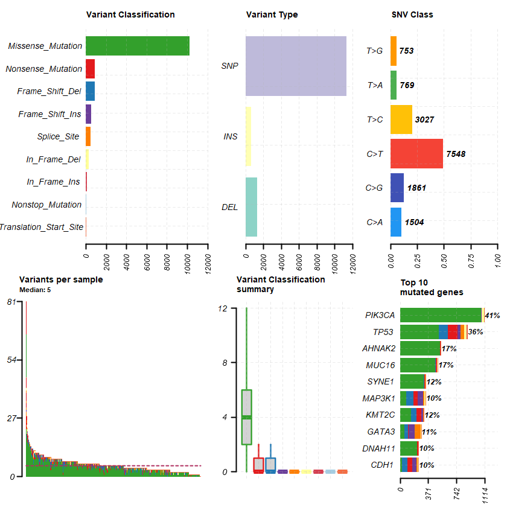
    


```R
genes %>% dplyr::filter(Hugo_Symbol %in% nrs)
```


<table class="dataframe">
<caption>A data.table: 1 × 13</caption>
<thead>
	<tr><th scope=col>Hugo_Symbol</th><th scope=col>Frame_Shift_Del</th><th scope=col>Frame_Shift_Ins</th><th scope=col>In_Frame_Del</th><th scope=col>In_Frame_Ins</th><th scope=col>Missense_Mutation</th><th scope=col>Nonsense_Mutation</th><th scope=col>Nonstop_Mutation</th><th scope=col>Splice_Site</th><th scope=col>Translation_Start_Site</th><th scope=col>total</th><th scope=col>MutatedSamples</th><th scope=col>AlteredSamples</th></tr>
	<tr><th scope=col>&lt;chr&gt;</th><th scope=col>&lt;int&gt;</th><th scope=col>&lt;int&gt;</th><th scope=col>&lt;int&gt;</th><th scope=col>&lt;int&gt;</th><th scope=col>&lt;int&gt;</th><th scope=col>&lt;int&gt;</th><th scope=col>&lt;int&gt;</th><th scope=col>&lt;int&gt;</th><th scope=col>&lt;int&gt;</th><th scope=col>&lt;dbl&gt;</th><th scope=col>&lt;int&gt;</th><th scope=col>&lt;int&gt;</th></tr>
</thead>
<tbody>
	<tr><td>NR3C1</td><td>0</td><td>0</td><td>0</td><td>0</td><td>12</td><td>0</td><td>0</td><td>0</td><td>0</td><td>12</td><td>12</td><td>12</td></tr>
</tbody>
</table>


```R
sets = c("MUC16", "TP53", "PIK3CA")
sts <- c(sets, nrs)
oncoplot(maf=df, genes = sts)
```


    
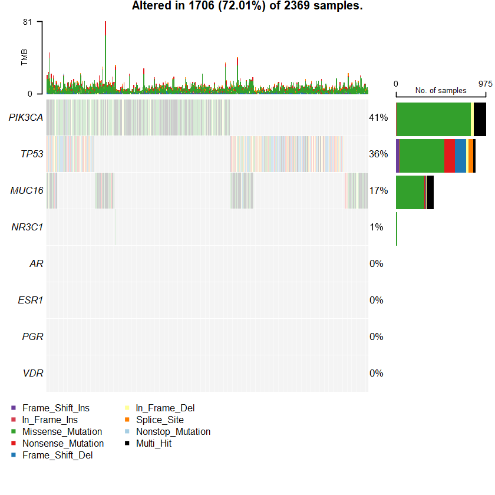
    


```R

```

## TCGA
Samples: 1066


```R
df = read.maf(maf = "brca_tcga_data_mutations.txt")
samp = getSampleSummary(df)
head(samp, 10)
```

    -Reading
    -Validating
    --Removed 4243 duplicated variants
    -Silent variants: 43355 
    -Summarizing
    --Possible FLAGS among top ten genes:
      TTN
      MUC16
      FLG
    -Processing clinical data
    --Missing clinical data
    -Finished in 17.2s elapsed (13.2s cpu) 
    


<table class="dataframe">
<caption>A data.table: 10 × 11</caption>
<thead>
	<tr><th scope=col>Tumor_Sample_Barcode</th><th scope=col>Frame_Shift_Del</th><th scope=col>Frame_Shift_Ins</th><th scope=col>In_Frame_Del</th><th scope=col>In_Frame_Ins</th><th scope=col>Missense_Mutation</th><th scope=col>Nonsense_Mutation</th><th scope=col>Nonstop_Mutation</th><th scope=col>Splice_Site</th><th scope=col>Translation_Start_Site</th><th scope=col>total</th></tr>
	<tr><th scope=col>&lt;fct&gt;</th><th scope=col>&lt;int&gt;</th><th scope=col>&lt;int&gt;</th><th scope=col>&lt;int&gt;</th><th scope=col>&lt;int&gt;</th><th scope=col>&lt;int&gt;</th><th scope=col>&lt;int&gt;</th><th scope=col>&lt;int&gt;</th><th scope=col>&lt;int&gt;</th><th scope=col>&lt;int&gt;</th><th scope=col>&lt;dbl&gt;</th></tr>
</thead>
<tbody>
	<tr><td>TCGA-AN-A046-01</td><td>   3</td><td>12</td><td> 0</td><td>0</td><td>4472</td><td>757</td><td>6</td><td>90</td><td> 0</td><td>5340</td></tr>
	<tr><td>TCGA-AC-A23H-01</td><td>  16</td><td> 3</td><td> 1</td><td>0</td><td>3622</td><td>403</td><td>7</td><td>73</td><td>10</td><td>4135</td></tr>
	<tr><td>TCGA-EW-A2FV-01</td><td>3825</td><td> 0</td><td> 0</td><td>0</td><td>  19</td><td>  0</td><td>0</td><td>34</td><td> 0</td><td>3878</td></tr>
	<tr><td>TCGA-D8-A27V-01</td><td>2868</td><td> 0</td><td> 1</td><td>0</td><td> 140</td><td> 16</td><td>0</td><td>44</td><td> 1</td><td>3070</td></tr>
	<tr><td>TCGA-BH-A18G-01</td><td> 129</td><td>40</td><td>12</td><td>0</td><td> 969</td><td> 46</td><td>1</td><td>33</td><td> 2</td><td>1232</td></tr>
	<tr><td>TCGA-AN-A0AK-01</td><td> 132</td><td>47</td><td>33</td><td>2</td><td> 808</td><td> 47</td><td>0</td><td>33</td><td> 1</td><td>1103</td></tr>
	<tr><td>TCGA-A8-A09Z-01</td><td> 109</td><td>45</td><td>22</td><td>1</td><td> 818</td><td> 39</td><td>3</td><td>34</td><td> 2</td><td>1073</td></tr>
	<tr><td>TCGA-D8-A1XK-01</td><td>  68</td><td>15</td><td> 2</td><td>0</td><td> 780</td><td> 17</td><td>2</td><td>61</td><td> 0</td><td> 945</td></tr>
	<tr><td>TCGA-BH-A0HF-01</td><td>   1</td><td> 1</td><td> 0</td><td>0</td><td> 745</td><td> 49</td><td>0</td><td>27</td><td> 0</td><td> 823</td></tr>
	<tr><td>TCGA-AO-A128-01</td><td>  30</td><td> 3</td><td> 2</td><td>0</td><td> 728</td><td> 26</td><td>2</td><td>23</td><td> 1</td><td> 815</td></tr>
</tbody>
</table>


```R
genes = getGeneSummary(df)
head(genes,10)
```


<table class="dataframe">
<caption>A data.table: 10 × 13</caption>
<thead>
	<tr><th scope=col>Hugo_Symbol</th><th scope=col>Frame_Shift_Del</th><th scope=col>Frame_Shift_Ins</th><th scope=col>In_Frame_Del</th><th scope=col>In_Frame_Ins</th><th scope=col>Missense_Mutation</th><th scope=col>Nonsense_Mutation</th><th scope=col>Nonstop_Mutation</th><th scope=col>Splice_Site</th><th scope=col>Translation_Start_Site</th><th scope=col>total</th><th scope=col>MutatedSamples</th><th scope=col>AlteredSamples</th></tr>
	<tr><th scope=col>&lt;chr&gt;</th><th scope=col>&lt;int&gt;</th><th scope=col>&lt;int&gt;</th><th scope=col>&lt;int&gt;</th><th scope=col>&lt;int&gt;</th><th scope=col>&lt;int&gt;</th><th scope=col>&lt;int&gt;</th><th scope=col>&lt;int&gt;</th><th scope=col>&lt;int&gt;</th><th scope=col>&lt;int&gt;</th><th scope=col>&lt;dbl&gt;</th><th scope=col>&lt;int&gt;</th><th scope=col>&lt;int&gt;</th></tr>
</thead>
<tbody>
	<tr><td>PIK3CA</td><td> 0</td><td> 0</td><td>15</td><td>1</td><td>370</td><td> 0</td><td>0</td><td> 0</td><td>0</td><td>386</td><td>346</td><td>346</td></tr>
	<tr><td>TP53  </td><td>47</td><td>14</td><td> 5</td><td>0</td><td>216</td><td>46</td><td>0</td><td>24</td><td>0</td><td>352</td><td>346</td><td>346</td></tr>
	<tr><td>TTN   </td><td>21</td><td> 0</td><td> 1</td><td>1</td><td>259</td><td>20</td><td>0</td><td> 6</td><td>0</td><td>308</td><td>186</td><td>186</td></tr>
	<tr><td>GATA3 </td><td>24</td><td>65</td><td> 1</td><td>0</td><td> 13</td><td> 4</td><td>0</td><td>23</td><td>0</td><td>130</td><td>127</td><td>127</td></tr>
	<tr><td>CDH1  </td><td>34</td><td>32</td><td> 4</td><td>0</td><td> 15</td><td>31</td><td>0</td><td>13</td><td>0</td><td>129</td><td>127</td><td>127</td></tr>
	<tr><td>MUC16 </td><td>15</td><td> 1</td><td> 0</td><td>0</td><td>128</td><td> 8</td><td>0</td><td> 0</td><td>0</td><td>152</td><td>109</td><td>109</td></tr>
	<tr><td>KMT2C </td><td>22</td><td>10</td><td> 1</td><td>0</td><td> 45</td><td>34</td><td>0</td><td> 3</td><td>0</td><td>115</td><td> 97</td><td> 97</td></tr>
	<tr><td>MAP3K1</td><td>39</td><td>32</td><td> 4</td><td>0</td><td> 29</td><td>22</td><td>0</td><td> 4</td><td>0</td><td>130</td><td> 89</td><td> 89</td></tr>
	<tr><td>FLG   </td><td> 1</td><td> 0</td><td> 2</td><td>0</td><td> 69</td><td> 4</td><td>0</td><td> 0</td><td>0</td><td> 76</td><td> 66</td><td> 66</td></tr>
	<tr><td>RYR2  </td><td> 2</td><td> 0</td><td> 0</td><td>0</td><td> 74</td><td> 3</td><td>0</td><td> 4</td><td>0</td><td> 83</td><td> 65</td><td> 65</td></tr>
</tbody>
</table>


```R
plotmafSummary(maf = df, rmOutlier = TRUE, addStat = 'median', dashboard = TRUE, titvRaw = FALSE)
```


    
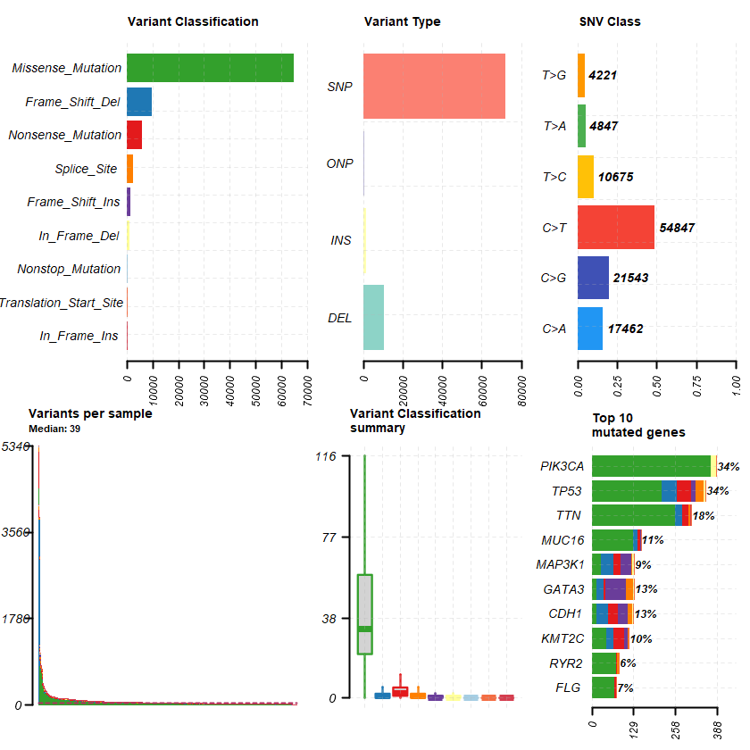
    


```R
genes %>% dplyr::filter(Hugo_Symbol %in% nrs)
```


<table class="dataframe">
<caption>A data.table: 5 × 13</caption>
<thead>
	<tr><th scope=col>Hugo_Symbol</th><th scope=col>Frame_Shift_Del</th><th scope=col>Frame_Shift_Ins</th><th scope=col>In_Frame_Del</th><th scope=col>In_Frame_Ins</th><th scope=col>Missense_Mutation</th><th scope=col>Nonsense_Mutation</th><th scope=col>Nonstop_Mutation</th><th scope=col>Splice_Site</th><th scope=col>Translation_Start_Site</th><th scope=col>total</th><th scope=col>MutatedSamples</th><th scope=col>AlteredSamples</th></tr>
	<tr><th scope=col>&lt;chr&gt;</th><th scope=col>&lt;int&gt;</th><th scope=col>&lt;int&gt;</th><th scope=col>&lt;int&gt;</th><th scope=col>&lt;int&gt;</th><th scope=col>&lt;int&gt;</th><th scope=col>&lt;int&gt;</th><th scope=col>&lt;int&gt;</th><th scope=col>&lt;int&gt;</th><th scope=col>&lt;int&gt;</th><th scope=col>&lt;dbl&gt;</th><th scope=col>&lt;int&gt;</th><th scope=col>&lt;int&gt;</th></tr>
</thead>
<tbody>
	<tr><td>ESR1 </td><td>1</td><td>0</td><td>1</td><td>0</td><td>6</td><td>1</td><td>0</td><td>0</td><td>0</td><td>9</td><td>9</td><td>9</td></tr>
	<tr><td>AR   </td><td>1</td><td>0</td><td>0</td><td>0</td><td>5</td><td>1</td><td>1</td><td>0</td><td>0</td><td>8</td><td>8</td><td>8</td></tr>
	<tr><td>PGR  </td><td>0</td><td>1</td><td>0</td><td>0</td><td>7</td><td>0</td><td>0</td><td>0</td><td>0</td><td>8</td><td>7</td><td>7</td></tr>
	<tr><td>NR3C1</td><td>0</td><td>0</td><td>0</td><td>0</td><td>3</td><td>1</td><td>0</td><td>0</td><td>0</td><td>4</td><td>4</td><td>4</td></tr>
	<tr><td>VDR  </td><td>0</td><td>0</td><td>0</td><td>0</td><td>2</td><td>0</td><td>0</td><td>0</td><td>0</td><td>2</td><td>2</td><td>2</td></tr>
</tbody>
</table>


```R
sets = c("TTN", "TP53", "PIK3CA")
sts <- c(sets, nrs)
oncoplot(maf=df, genes = sts)
```


    
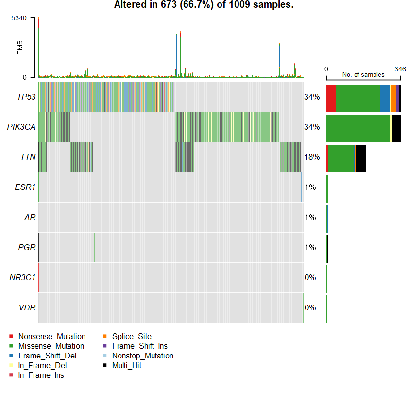
    


```R

```

## Alterations in PTEN and ESR1 promote clinical resistance to alpelisib plus aromatase inhibitors
Breast Cancer (MSK, Nature Cancer 2020)

[REF: 32864625](https://doi.org/10.1038/s43018-020-0047-1)

Samples: 141


```R
df = read.maf(maf = "breast_alpelisib_2020_data_mutations.txt")
samp = getSampleSummary(df)
head(samp, 10)
```

    -Reading
    -Validating
    -Silent variants: 55 
    -Summarizing
    --Mutiple centers found
    NA;MSKCC-Processing clinical data
    --Missing clinical data
    -Finished in 0.140s elapsed (0.040s cpu) 
    


<table class="dataframe">
<caption>A data.table: 10 × 10</caption>
<thead>
	<tr><th scope=col>Tumor_Sample_Barcode</th><th scope=col>Frame_Shift_Del</th><th scope=col>Frame_Shift_Ins</th><th scope=col>In_Frame_Del</th><th scope=col>In_Frame_Ins</th><th scope=col>Missense_Mutation</th><th scope=col>Nonsense_Mutation</th><th scope=col>Splice_Site</th><th scope=col>Translation_Start_Site</th><th scope=col>total</th></tr>
	<tr><th scope=col>&lt;fct&gt;</th><th scope=col>&lt;int&gt;</th><th scope=col>&lt;int&gt;</th><th scope=col>&lt;int&gt;</th><th scope=col>&lt;int&gt;</th><th scope=col>&lt;int&gt;</th><th scope=col>&lt;int&gt;</th><th scope=col>&lt;int&gt;</th><th scope=col>&lt;int&gt;</th><th scope=col>&lt;dbl&gt;</th></tr>
</thead>
<tbody>
	<tr><td>P040-04-Post-cfDNA</td><td>2</td><td>0</td><td>1</td><td>0</td><td>54</td><td>11</td><td>1</td><td>0</td><td>69</td></tr>
	<tr><td>P009-04-Post-cfDNA</td><td>0</td><td>1</td><td>0</td><td>0</td><td>52</td><td> 8</td><td>0</td><td>0</td><td>61</td></tr>
	<tr><td>P040-02-Pre-cfDNA </td><td>2</td><td>0</td><td>0</td><td>1</td><td>47</td><td> 9</td><td>1</td><td>0</td><td>60</td></tr>
	<tr><td>P009-02-Pre-cfDNA </td><td>0</td><td>0</td><td>0</td><td>0</td><td>27</td><td> 3</td><td>0</td><td>0</td><td>30</td></tr>
	<tr><td>P002-02-Pre-cfDNA </td><td>2</td><td>2</td><td>0</td><td>0</td><td>16</td><td> 6</td><td>0</td><td>0</td><td>26</td></tr>
	<tr><td>P-0000247-T02-IM5 </td><td>0</td><td>1</td><td>0</td><td>0</td><td>17</td><td> 2</td><td>0</td><td>0</td><td>20</td></tr>
	<tr><td>P046-04-Post-cfDNA</td><td>0</td><td>0</td><td>0</td><td>0</td><td>17</td><td> 1</td><td>0</td><td>0</td><td>18</td></tr>
	<tr><td>P054-04-Post-cfDNA</td><td>0</td><td>0</td><td>0</td><td>0</td><td>16</td><td> 0</td><td>0</td><td>0</td><td>16</td></tr>
	<tr><td>P-0000138-T02-IM3 </td><td>0</td><td>0</td><td>0</td><td>0</td><td>13</td><td> 1</td><td>0</td><td>0</td><td>14</td></tr>
	<tr><td>P-0000216-T02-IM3 </td><td>0</td><td>0</td><td>0</td><td>0</td><td> 8</td><td> 1</td><td>0</td><td>0</td><td> 9</td></tr>
</tbody>
</table>


```R
genes = getGeneSummary(df)
head(genes,10)
```


<table class="dataframe">
<caption>A data.table: 10 × 12</caption>
<thead>
	<tr><th scope=col>Hugo_Symbol</th><th scope=col>Frame_Shift_Del</th><th scope=col>Frame_Shift_Ins</th><th scope=col>In_Frame_Del</th><th scope=col>In_Frame_Ins</th><th scope=col>Missense_Mutation</th><th scope=col>Nonsense_Mutation</th><th scope=col>Splice_Site</th><th scope=col>Translation_Start_Site</th><th scope=col>total</th><th scope=col>MutatedSamples</th><th scope=col>AlteredSamples</th></tr>
	<tr><th scope=col>&lt;chr&gt;</th><th scope=col>&lt;int&gt;</th><th scope=col>&lt;int&gt;</th><th scope=col>&lt;int&gt;</th><th scope=col>&lt;int&gt;</th><th scope=col>&lt;int&gt;</th><th scope=col>&lt;int&gt;</th><th scope=col>&lt;int&gt;</th><th scope=col>&lt;int&gt;</th><th scope=col>&lt;dbl&gt;</th><th scope=col>&lt;int&gt;</th><th scope=col>&lt;int&gt;</th></tr>
</thead>
<tbody>
	<tr><td>PIK3CA</td><td>0</td><td>0</td><td>1</td><td>0</td><td>139</td><td> 0</td><td>0</td><td>0</td><td>140</td><td>110</td><td>110</td></tr>
	<tr><td>ESR1  </td><td>0</td><td>0</td><td>0</td><td>0</td><td> 60</td><td> 0</td><td>0</td><td>0</td><td> 60</td><td> 38</td><td> 38</td></tr>
	<tr><td>TP53  </td><td>7</td><td>1</td><td>1</td><td>0</td><td> 45</td><td>17</td><td>3</td><td>0</td><td> 74</td><td> 36</td><td> 36</td></tr>
	<tr><td>ARID1A</td><td>2</td><td>4</td><td>0</td><td>0</td><td> 12</td><td> 6</td><td>0</td><td>0</td><td> 24</td><td> 23</td><td> 23</td></tr>
	<tr><td>CDH1  </td><td>4</td><td>7</td><td>0</td><td>0</td><td>  5</td><td> 1</td><td>1</td><td>1</td><td> 19</td><td> 19</td><td> 19</td></tr>
	<tr><td>NF1   </td><td>2</td><td>0</td><td>0</td><td>0</td><td> 15</td><td> 9</td><td>2</td><td>0</td><td> 28</td><td> 17</td><td> 17</td></tr>
	<tr><td>APC   </td><td>0</td><td>0</td><td>0</td><td>0</td><td> 22</td><td> 2</td><td>0</td><td>0</td><td> 24</td><td> 12</td><td> 12</td></tr>
	<tr><td>BRCA2 </td><td>0</td><td>0</td><td>2</td><td>0</td><td> 17</td><td> 2</td><td>0</td><td>0</td><td> 21</td><td> 12</td><td> 12</td></tr>
	<tr><td>MTOR  </td><td>0</td><td>0</td><td>1</td><td>0</td><td> 13</td><td> 3</td><td>0</td><td>0</td><td> 17</td><td> 12</td><td> 12</td></tr>
	<tr><td>PTEN  </td><td>1</td><td>1</td><td>0</td><td>0</td><td> 11</td><td> 3</td><td>0</td><td>0</td><td> 16</td><td> 12</td><td> 12</td></tr>
</tbody>
</table>


```R
plotmafSummary(maf = df, rmOutlier = TRUE, addStat = 'median', dashboard = TRUE, titvRaw = FALSE)
```


    
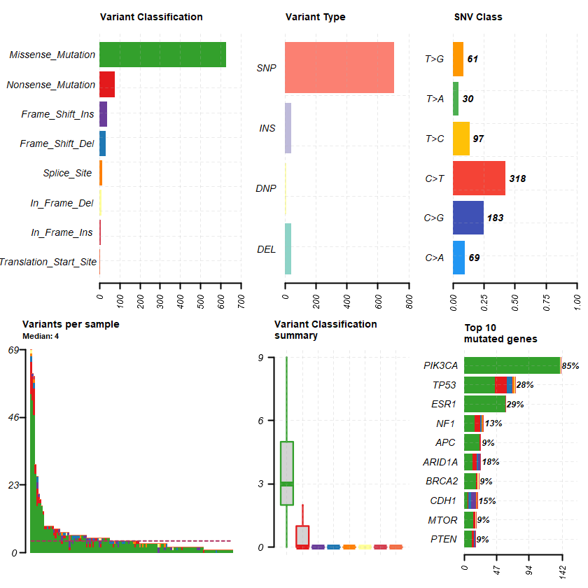
    


```R
genes %>% dplyr::filter(Hugo_Symbol %in% nrs)
```


<table class="dataframe">
<caption>A data.table: 2 × 12</caption>
<thead>
	<tr><th scope=col>Hugo_Symbol</th><th scope=col>Frame_Shift_Del</th><th scope=col>Frame_Shift_Ins</th><th scope=col>In_Frame_Del</th><th scope=col>In_Frame_Ins</th><th scope=col>Missense_Mutation</th><th scope=col>Nonsense_Mutation</th><th scope=col>Splice_Site</th><th scope=col>Translation_Start_Site</th><th scope=col>total</th><th scope=col>MutatedSamples</th><th scope=col>AlteredSamples</th></tr>
	<tr><th scope=col>&lt;chr&gt;</th><th scope=col>&lt;int&gt;</th><th scope=col>&lt;int&gt;</th><th scope=col>&lt;int&gt;</th><th scope=col>&lt;int&gt;</th><th scope=col>&lt;int&gt;</th><th scope=col>&lt;int&gt;</th><th scope=col>&lt;int&gt;</th><th scope=col>&lt;int&gt;</th><th scope=col>&lt;dbl&gt;</th><th scope=col>&lt;int&gt;</th><th scope=col>&lt;int&gt;</th></tr>
</thead>
<tbody>
	<tr><td>ESR1</td><td>0</td><td>0</td><td>0</td><td>0</td><td>60</td><td>0</td><td>0</td><td>0</td><td>60</td><td>38</td><td>38</td></tr>
	<tr><td>AR  </td><td>0</td><td>0</td><td>0</td><td>0</td><td>12</td><td>0</td><td>0</td><td>0</td><td>12</td><td> 7</td><td> 7</td></tr>
</tbody>
</table>


```R
sets = c("ARID1A", "TP53", "PIK3CA")
sts <- c(sets, nrs)
oncoplot(maf=df, genes = sts)
```


    
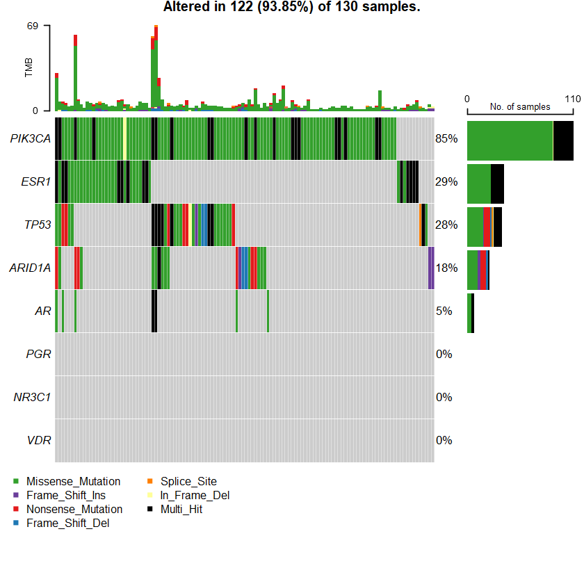
    


```R

```

## Proteogenomic Landscape of Breast Cancer Tumorigenesis and Targeted Therapy
[33212010](https://doi.org/10.1016/j.cell.2020.10.036)
Proteogenomic landscape of breast cancer (CPTAC, Cell 2020)

Samples : 122


```R
df = read.maf(maf = "brca_cptac_2020_data_mutations.txt")
samp = getSampleSummary(df)
head(samp, 10)
```

    -Reading
    -Validating
    -Silent variants: 9470 
    -Summarizing
    --Possible FLAGS among top ten genes:
      TTN
      MUC16
      HMCN1
      AHNAK
      OBSCN
      FLG
    -Processing clinical data
    --Missing clinical data
    -Finished in 2.710s elapsed (1.720s cpu) 
    


<table class="dataframe">
<caption>A data.table: 10 × 11</caption>
<thead>
	<tr><th scope=col>Tumor_Sample_Barcode</th><th scope=col>Frame_Shift_Del</th><th scope=col>Frame_Shift_Ins</th><th scope=col>In_Frame_Del</th><th scope=col>In_Frame_Ins</th><th scope=col>Missense_Mutation</th><th scope=col>Nonsense_Mutation</th><th scope=col>Nonstop_Mutation</th><th scope=col>Splice_Site</th><th scope=col>Translation_Start_Site</th><th scope=col>total</th></tr>
	<tr><th scope=col>&lt;fct&gt;</th><th scope=col>&lt;int&gt;</th><th scope=col>&lt;int&gt;</th><th scope=col>&lt;int&gt;</th><th scope=col>&lt;int&gt;</th><th scope=col>&lt;int&gt;</th><th scope=col>&lt;int&gt;</th><th scope=col>&lt;int&gt;</th><th scope=col>&lt;int&gt;</th><th scope=col>&lt;int&gt;</th><th scope=col>&lt;dbl&gt;</th></tr>
</thead>
<tbody>
	<tr><td>X01BR043</td><td>  8</td><td> 1</td><td> 2</td><td>1</td><td>7328</td><td>394</td><td>1</td><td>108</td><td>16</td><td>7859</td></tr>
	<tr><td>X18BR003</td><td>  2</td><td> 0</td><td> 0</td><td>1</td><td> 891</td><td> 84</td><td>3</td><td> 15</td><td> 1</td><td> 997</td></tr>
	<tr><td>X11BR003</td><td>100</td><td>18</td><td> 5</td><td>0</td><td> 623</td><td> 27</td><td>1</td><td> 23</td><td> 0</td><td> 797</td></tr>
	<tr><td>X15BR003</td><td>  3</td><td> 1</td><td> 0</td><td>0</td><td> 579</td><td> 58</td><td>4</td><td> 12</td><td> 1</td><td> 658</td></tr>
	<tr><td>X05BR038</td><td>  0</td><td> 0</td><td> 1</td><td>0</td><td> 332</td><td> 42</td><td>0</td><td>  6</td><td> 1</td><td> 382</td></tr>
	<tr><td>X05BR029</td><td> 46</td><td>11</td><td> 4</td><td>2</td><td> 256</td><td> 18</td><td>0</td><td> 10</td><td> 1</td><td> 348</td></tr>
	<tr><td>X11BR031</td><td>  3</td><td> 0</td><td> 0</td><td>0</td><td> 304</td><td> 33</td><td>0</td><td>  6</td><td> 0</td><td> 346</td></tr>
	<tr><td>X01BR018</td><td> 18</td><td> 0</td><td>12</td><td>3</td><td> 256</td><td> 10</td><td>1</td><td>  8</td><td> 0</td><td> 308</td></tr>
	<tr><td>X21BR001</td><td>  5</td><td> 0</td><td> 1</td><td>0</td><td> 229</td><td> 18</td><td>0</td><td>  9</td><td> 1</td><td> 263</td></tr>
	<tr><td>X01BR027</td><td>  4</td><td> 0</td><td> 0</td><td>0</td><td> 149</td><td> 12</td><td>0</td><td>  6</td><td> 1</td><td> 172</td></tr>
</tbody>
</table>


```R
genes = getGeneSummary(df)
head(genes,10)
```


<table class="dataframe">
<caption>A data.table: 10 × 13</caption>
<thead>
	<tr><th scope=col>Hugo_Symbol</th><th scope=col>Frame_Shift_Del</th><th scope=col>Frame_Shift_Ins</th><th scope=col>In_Frame_Del</th><th scope=col>In_Frame_Ins</th><th scope=col>Missense_Mutation</th><th scope=col>Nonsense_Mutation</th><th scope=col>Nonstop_Mutation</th><th scope=col>Splice_Site</th><th scope=col>Translation_Start_Site</th><th scope=col>total</th><th scope=col>MutatedSamples</th><th scope=col>AlteredSamples</th></tr>
	<tr><th scope=col>&lt;chr&gt;</th><th scope=col>&lt;int&gt;</th><th scope=col>&lt;int&gt;</th><th scope=col>&lt;int&gt;</th><th scope=col>&lt;int&gt;</th><th scope=col>&lt;int&gt;</th><th scope=col>&lt;int&gt;</th><th scope=col>&lt;int&gt;</th><th scope=col>&lt;int&gt;</th><th scope=col>&lt;int&gt;</th><th scope=col>&lt;dbl&gt;</th><th scope=col>&lt;int&gt;</th><th scope=col>&lt;int&gt;</th></tr>
</thead>
<tbody>
	<tr><td>TP53  </td><td>8</td><td>0</td><td>2</td><td>0</td><td>27</td><td>14</td><td>0</td><td>2</td><td>0</td><td>53</td><td>50</td><td>50</td></tr>
	<tr><td>PIK3CA</td><td>0</td><td>1</td><td>5</td><td>0</td><td>39</td><td> 0</td><td>0</td><td>0</td><td>0</td><td>45</td><td>40</td><td>40</td></tr>
	<tr><td>TTN   </td><td>0</td><td>0</td><td>0</td><td>0</td><td>86</td><td> 3</td><td>0</td><td>0</td><td>0</td><td>89</td><td>33</td><td>33</td></tr>
	<tr><td>MUC16 </td><td>2</td><td>0</td><td>0</td><td>0</td><td>34</td><td> 1</td><td>0</td><td>0</td><td>0</td><td>37</td><td>15</td><td>15</td></tr>
	<tr><td>HMCN1 </td><td>0</td><td>0</td><td>0</td><td>0</td><td>20</td><td> 2</td><td>0</td><td>2</td><td>0</td><td>24</td><td>13</td><td>13</td></tr>
	<tr><td>AHNAK </td><td>0</td><td>0</td><td>0</td><td>0</td><td>20</td><td> 1</td><td>0</td><td>0</td><td>0</td><td>21</td><td>13</td><td>13</td></tr>
	<tr><td>OBSCN </td><td>0</td><td>0</td><td>0</td><td>0</td><td>19</td><td> 1</td><td>0</td><td>0</td><td>0</td><td>20</td><td>13</td><td>13</td></tr>
	<tr><td>ABCA13</td><td>0</td><td>0</td><td>0</td><td>0</td><td>15</td><td> 4</td><td>0</td><td>0</td><td>0</td><td>19</td><td>13</td><td>13</td></tr>
	<tr><td>FLG   </td><td>0</td><td>0</td><td>0</td><td>0</td><td>24</td><td> 0</td><td>0</td><td>0</td><td>0</td><td>24</td><td>12</td><td>12</td></tr>
	<tr><td>MAP3K1</td><td>4</td><td>1</td><td>1</td><td>0</td><td> 6</td><td> 2</td><td>0</td><td>2</td><td>0</td><td>16</td><td>11</td><td>11</td></tr>
</tbody>
</table>


```R
plotmafSummary(maf = df, rmOutlier = TRUE, addStat = 'median', dashboard = TRUE, titvRaw = FALSE)
```


    
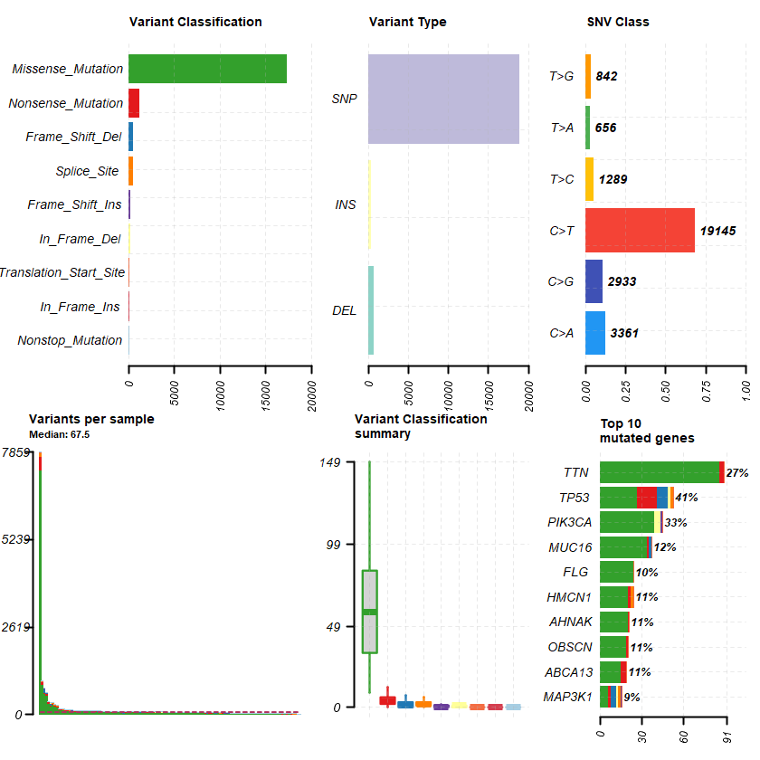
    


```R
genes %>% dplyr::filter(Hugo_Symbol %in% nrs)
```


<table class="dataframe">
<caption>A data.table: 4 × 13</caption>
<thead>
	<tr><th scope=col>Hugo_Symbol</th><th scope=col>Frame_Shift_Del</th><th scope=col>Frame_Shift_Ins</th><th scope=col>In_Frame_Del</th><th scope=col>In_Frame_Ins</th><th scope=col>Missense_Mutation</th><th scope=col>Nonsense_Mutation</th><th scope=col>Nonstop_Mutation</th><th scope=col>Splice_Site</th><th scope=col>Translation_Start_Site</th><th scope=col>total</th><th scope=col>MutatedSamples</th><th scope=col>AlteredSamples</th></tr>
	<tr><th scope=col>&lt;chr&gt;</th><th scope=col>&lt;int&gt;</th><th scope=col>&lt;int&gt;</th><th scope=col>&lt;int&gt;</th><th scope=col>&lt;int&gt;</th><th scope=col>&lt;int&gt;</th><th scope=col>&lt;int&gt;</th><th scope=col>&lt;int&gt;</th><th scope=col>&lt;int&gt;</th><th scope=col>&lt;int&gt;</th><th scope=col>&lt;dbl&gt;</th><th scope=col>&lt;int&gt;</th><th scope=col>&lt;int&gt;</th></tr>
</thead>
<tbody>
	<tr><td>AR   </td><td>0</td><td>0</td><td>0</td><td>0</td><td>3</td><td>0</td><td>0</td><td>0</td><td>0</td><td>3</td><td>3</td><td>3</td></tr>
	<tr><td>PGR  </td><td>0</td><td>0</td><td>0</td><td>0</td><td>2</td><td>0</td><td>0</td><td>0</td><td>0</td><td>2</td><td>2</td><td>2</td></tr>
	<tr><td>ESR1 </td><td>0</td><td>0</td><td>0</td><td>0</td><td>1</td><td>0</td><td>0</td><td>0</td><td>0</td><td>1</td><td>1</td><td>1</td></tr>
	<tr><td>NR3C1</td><td>0</td><td>0</td><td>0</td><td>0</td><td>1</td><td>0</td><td>0</td><td>0</td><td>0</td><td>1</td><td>1</td><td>1</td></tr>
</tbody>
</table>


```R
sets = c("TTN", "TP53", "PIK3CA")
sts <- c(sets, nrs)
oncoplot(maf=df, genes = sts)
```


    
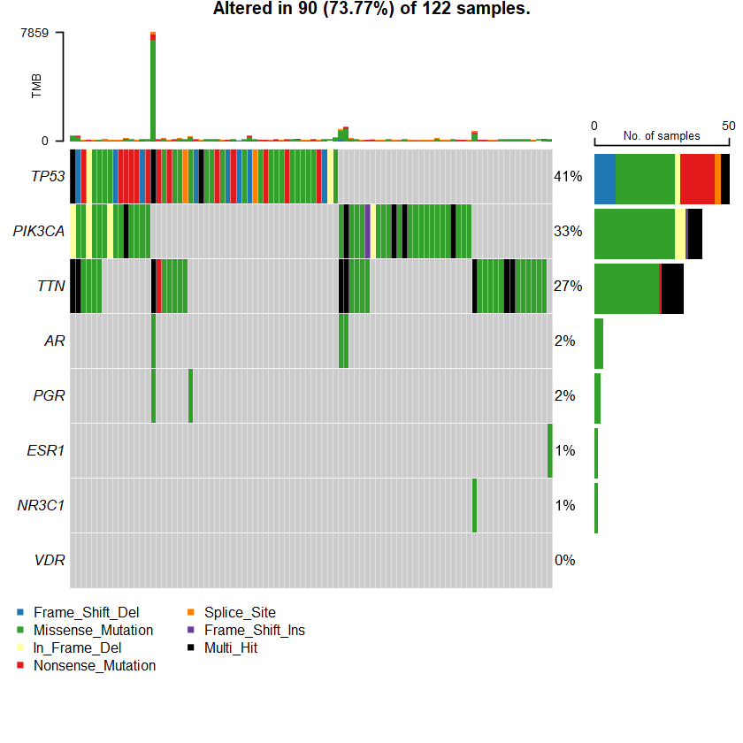
    


```R

```

## Dynamics of genomic clones in breast cancer patient xenografts at single-cell resolution
[REF : 25470049](https://doi.org/10.1038/nature13952)
Breast Cancer Xenografts (British Columbia, Nature 2015)

Samples: 117


```R
df = read.maf(maf = "brca_bccrc_data_mutations.txt")
samp = getSampleSummary(df)
head(samp, 10)
```

    -Reading
    -Validating
    -Silent variants: 29 
    -Summarizing
    --Mutiple centers found
    BC;--Possible FLAGS among top ten genes:
      USH2A
    -Processing clinical data
    --Missing clinical data
    -Finished in 0.500s elapsed (0.260s cpu) 
    


<table class="dataframe">
<caption>A data.table: 10 × 10</caption>
<thead>
	<tr><th scope=col>Tumor_Sample_Barcode</th><th scope=col>Frame_Shift_Del</th><th scope=col>Frame_Shift_Ins</th><th scope=col>In_Frame_Del</th><th scope=col>In_Frame_Ins</th><th scope=col>Missense_Mutation</th><th scope=col>Nonsense_Mutation</th><th scope=col>Nonstop_Mutation</th><th scope=col>Splice_Site</th><th scope=col>total</th></tr>
	<tr><th scope=col>&lt;fct&gt;</th><th scope=col>&lt;int&gt;</th><th scope=col>&lt;int&gt;</th><th scope=col>&lt;int&gt;</th><th scope=col>&lt;int&gt;</th><th scope=col>&lt;int&gt;</th><th scope=col>&lt;int&gt;</th><th scope=col>&lt;int&gt;</th><th scope=col>&lt;int&gt;</th><th scope=col>&lt;dbl&gt;</th></tr>
</thead>
<tbody>
	<tr><td>SA214</td><td> 0</td><td>0</td><td>0</td><td>0</td><td>174</td><td>18</td><td>0</td><td>1</td><td>193</td></tr>
	<tr><td>SA106</td><td> 4</td><td>2</td><td>2</td><td>0</td><td>116</td><td> 3</td><td>0</td><td>5</td><td>132</td></tr>
	<tr><td>SA218</td><td> 7</td><td>1</td><td>1</td><td>0</td><td>111</td><td> 6</td><td>0</td><td>0</td><td>126</td></tr>
	<tr><td>SA065</td><td>15</td><td>0</td><td>6</td><td>0</td><td> 85</td><td> 9</td><td>0</td><td>1</td><td>116</td></tr>
	<tr><td>SA071</td><td> 1</td><td>0</td><td>0</td><td>0</td><td> 86</td><td> 1</td><td>0</td><td>4</td><td> 92</td></tr>
	<tr><td>SA054</td><td> 2</td><td>0</td><td>0</td><td>0</td><td> 65</td><td> 3</td><td>0</td><td>4</td><td> 74</td></tr>
	<tr><td>SA077</td><td> 0</td><td>0</td><td>1</td><td>0</td><td> 64</td><td> 5</td><td>0</td><td>0</td><td> 70</td></tr>
	<tr><td>SA031</td><td> 1</td><td>0</td><td>0</td><td>0</td><td> 61</td><td> 2</td><td>0</td><td>1</td><td> 65</td></tr>
	<tr><td>SA084</td><td> 0</td><td>1</td><td>0</td><td>0</td><td> 52</td><td>10</td><td>0</td><td>0</td><td> 63</td></tr>
	<tr><td>SA225</td><td> 2</td><td>0</td><td>2</td><td>0</td><td> 52</td><td> 7</td><td>0</td><td>0</td><td> 63</td></tr>
</tbody>
</table>


```R
genes = getGeneSummary(df)
head(genes,10)
```


<table class="dataframe">
<caption>A data.table: 10 × 12</caption>
<thead>
	<tr><th scope=col>Hugo_Symbol</th><th scope=col>Frame_Shift_Del</th><th scope=col>Frame_Shift_Ins</th><th scope=col>In_Frame_Del</th><th scope=col>In_Frame_Ins</th><th scope=col>Missense_Mutation</th><th scope=col>Nonsense_Mutation</th><th scope=col>Nonstop_Mutation</th><th scope=col>Splice_Site</th><th scope=col>total</th><th scope=col>MutatedSamples</th><th scope=col>AlteredSamples</th></tr>
	<tr><th scope=col>&lt;chr&gt;</th><th scope=col>&lt;int&gt;</th><th scope=col>&lt;int&gt;</th><th scope=col>&lt;int&gt;</th><th scope=col>&lt;int&gt;</th><th scope=col>&lt;int&gt;</th><th scope=col>&lt;int&gt;</th><th scope=col>&lt;int&gt;</th><th scope=col>&lt;int&gt;</th><th scope=col>&lt;dbl&gt;</th><th scope=col>&lt;int&gt;</th><th scope=col>&lt;int&gt;</th></tr>
</thead>
<tbody>
	<tr><td>TP53  </td><td>1</td><td>0</td><td>0</td><td>0</td><td>23</td><td>8</td><td>0</td><td>3</td><td>35</td><td>35</td><td>35</td></tr>
	<tr><td>PIK3CA</td><td>0</td><td>0</td><td>1</td><td>0</td><td> 6</td><td>0</td><td>0</td><td>0</td><td> 7</td><td> 7</td><td> 7</td></tr>
	<tr><td>USH2A </td><td>0</td><td>0</td><td>0</td><td>0</td><td> 7</td><td>0</td><td>0</td><td>0</td><td> 7</td><td> 6</td><td> 6</td></tr>
	<tr><td>MYO3A </td><td>0</td><td>0</td><td>0</td><td>0</td><td> 5</td><td>1</td><td>0</td><td>0</td><td> 6</td><td> 6</td><td> 6</td></tr>
	<tr><td>PTEN  </td><td>2</td><td>0</td><td>0</td><td>0</td><td> 4</td><td>0</td><td>0</td><td>0</td><td> 6</td><td> 5</td><td> 5</td></tr>
	<tr><td>ATR   </td><td>1</td><td>0</td><td>0</td><td>0</td><td> 4</td><td>0</td><td>0</td><td>0</td><td> 5</td><td> 4</td><td> 4</td></tr>
	<tr><td>COL6A3</td><td>0</td><td>0</td><td>0</td><td>0</td><td> 3</td><td>1</td><td>0</td><td>0</td><td> 4</td><td> 4</td><td> 4</td></tr>
	<tr><td>GPR112</td><td>0</td><td>0</td><td>0</td><td>0</td><td> 4</td><td>0</td><td>0</td><td>0</td><td> 4</td><td> 4</td><td> 4</td></tr>
	<tr><td>LRP2  </td><td>0</td><td>0</td><td>0</td><td>0</td><td> 4</td><td>0</td><td>0</td><td>0</td><td> 4</td><td> 4</td><td> 4</td></tr>
	<tr><td>MDN1  </td><td>0</td><td>0</td><td>0</td><td>0</td><td> 3</td><td>1</td><td>0</td><td>0</td><td> 4</td><td> 4</td><td> 4</td></tr>
</tbody>
</table>


```R
plotmafSummary(maf = df, rmOutlier = TRUE, addStat = 'median', dashboard = TRUE, titvRaw = FALSE)
```


    
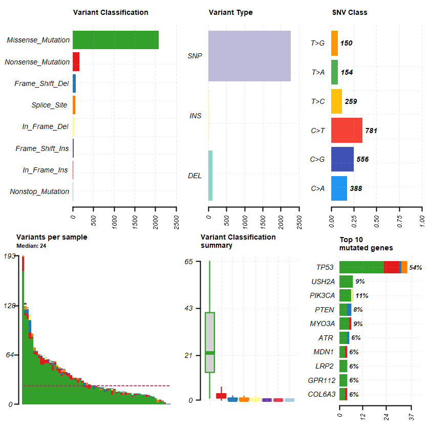
    


```R
genes %>% dplyr::filter(Hugo_Symbol %in% nrs)
```


<table class="dataframe">
<caption>A data.table: 1 × 12</caption>
<thead>
	<tr><th scope=col>Hugo_Symbol</th><th scope=col>Frame_Shift_Del</th><th scope=col>Frame_Shift_Ins</th><th scope=col>In_Frame_Del</th><th scope=col>In_Frame_Ins</th><th scope=col>Missense_Mutation</th><th scope=col>Nonsense_Mutation</th><th scope=col>Nonstop_Mutation</th><th scope=col>Splice_Site</th><th scope=col>total</th><th scope=col>MutatedSamples</th><th scope=col>AlteredSamples</th></tr>
	<tr><th scope=col>&lt;chr&gt;</th><th scope=col>&lt;int&gt;</th><th scope=col>&lt;int&gt;</th><th scope=col>&lt;int&gt;</th><th scope=col>&lt;int&gt;</th><th scope=col>&lt;int&gt;</th><th scope=col>&lt;int&gt;</th><th scope=col>&lt;int&gt;</th><th scope=col>&lt;int&gt;</th><th scope=col>&lt;dbl&gt;</th><th scope=col>&lt;int&gt;</th><th scope=col>&lt;int&gt;</th></tr>
</thead>
<tbody>
	<tr><td>NR3C1</td><td>1</td><td>0</td><td>0</td><td>0</td><td>2</td><td>0</td><td>0</td><td>0</td><td>3</td><td>3</td><td>3</td></tr>
</tbody>
</table>


```R
sets = c("USH2A", "TP53", "PIK3CA")
sts <- c(sets, nrs)
oncoplot(maf=df, genes = sts)
```


    
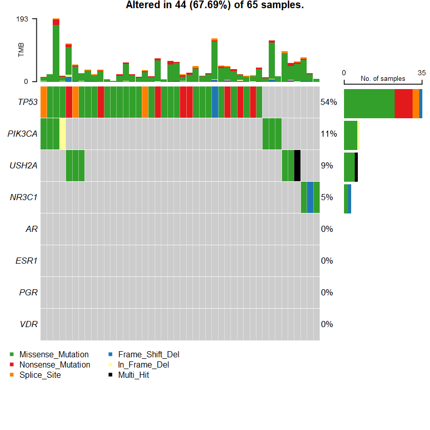
    


```R

```

## Sequence analysis of mutations and translocations across breast cancer subtypes
[REF: 22722202](https://doi.org/10.1038/nature11154)
Breast Invasive Carcinoma (Broad, Nature 2012)

Samples: 103


```R
df = read.maf(maf = "brca_broad_data_mutations.txt")
samp = getSampleSummary(df)
head(samp, 10)
```

    -Reading
    -Validating
    -Silent variants: 1282 
    -Summarizing
    --Possible FLAGS among top ten genes:
      TTN
      FLG
      MUC16
    -Processing clinical data
    --Missing clinical data
    -Finished in 0.880s elapsed (0.560s cpu) 
    


<table class="dataframe">
<caption>A data.table: 10 × 11</caption>
<thead>
	<tr><th scope=col>Tumor_Sample_Barcode</th><th scope=col>Frame_Shift_Del</th><th scope=col>Frame_Shift_Ins</th><th scope=col>In_Frame_Del</th><th scope=col>In_Frame_Ins</th><th scope=col>Missense_Mutation</th><th scope=col>Nonsense_Mutation</th><th scope=col>Nonstop_Mutation</th><th scope=col>Splice_Site</th><th scope=col>Translation_Start_Site</th><th scope=col>total</th></tr>
	<tr><th scope=col>&lt;fct&gt;</th><th scope=col>&lt;int&gt;</th><th scope=col>&lt;int&gt;</th><th scope=col>&lt;int&gt;</th><th scope=col>&lt;int&gt;</th><th scope=col>&lt;int&gt;</th><th scope=col>&lt;int&gt;</th><th scope=col>&lt;int&gt;</th><th scope=col>&lt;int&gt;</th><th scope=col>&lt;int&gt;</th><th scope=col>&lt;dbl&gt;</th></tr>
</thead>
<tbody>
	<tr><td>BR-M-191</td><td>1</td><td>1</td><td>1</td><td>0</td><td>203</td><td>21</td><td>1</td><td>3</td><td>0</td><td>231</td></tr>
	<tr><td>BR-M-037</td><td>1</td><td>0</td><td>0</td><td>0</td><td>126</td><td>20</td><td>0</td><td>3</td><td>0</td><td>150</td></tr>
	<tr><td>BR-V-043</td><td>3</td><td>0</td><td>0</td><td>0</td><td>113</td><td> 5</td><td>0</td><td>6</td><td>1</td><td>128</td></tr>
	<tr><td>BR-V-027</td><td>0</td><td>0</td><td>0</td><td>0</td><td>102</td><td> 8</td><td>1</td><td>3</td><td>0</td><td>114</td></tr>
	<tr><td>BR-V-067</td><td>2</td><td>0</td><td>0</td><td>0</td><td> 93</td><td> 8</td><td>0</td><td>2</td><td>0</td><td>105</td></tr>
	<tr><td>BR-M-045</td><td>2</td><td>0</td><td>0</td><td>0</td><td> 89</td><td> 5</td><td>0</td><td>4</td><td>1</td><td>101</td></tr>
	<tr><td>BR-M-116</td><td>5</td><td>9</td><td>5</td><td>0</td><td> 74</td><td> 4</td><td>0</td><td>3</td><td>1</td><td>101</td></tr>
	<tr><td>BR-V-002</td><td>0</td><td>0</td><td>0</td><td>0</td><td> 64</td><td> 9</td><td>0</td><td>3</td><td>0</td><td> 76</td></tr>
	<tr><td>BR-V-037</td><td>2</td><td>0</td><td>0</td><td>0</td><td> 66</td><td> 2</td><td>0</td><td>3</td><td>1</td><td> 74</td></tr>
	<tr><td>BR-M-055</td><td>1</td><td>1</td><td>0</td><td>0</td><td> 59</td><td> 4</td><td>0</td><td>0</td><td>0</td><td> 65</td></tr>
</tbody>
</table>


```R
genes = getGeneSummary(df)
head(genes,10)
```


<table class="dataframe">
<caption>A data.table: 10 × 13</caption>
<thead>
	<tr><th scope=col>Hugo_Symbol</th><th scope=col>Frame_Shift_Del</th><th scope=col>Frame_Shift_Ins</th><th scope=col>In_Frame_Del</th><th scope=col>In_Frame_Ins</th><th scope=col>Missense_Mutation</th><th scope=col>Nonsense_Mutation</th><th scope=col>Nonstop_Mutation</th><th scope=col>Splice_Site</th><th scope=col>Translation_Start_Site</th><th scope=col>total</th><th scope=col>MutatedSamples</th><th scope=col>AlteredSamples</th></tr>
	<tr><th scope=col>&lt;chr&gt;</th><th scope=col>&lt;int&gt;</th><th scope=col>&lt;int&gt;</th><th scope=col>&lt;int&gt;</th><th scope=col>&lt;int&gt;</th><th scope=col>&lt;int&gt;</th><th scope=col>&lt;int&gt;</th><th scope=col>&lt;int&gt;</th><th scope=col>&lt;int&gt;</th><th scope=col>&lt;int&gt;</th><th scope=col>&lt;dbl&gt;</th><th scope=col>&lt;int&gt;</th><th scope=col>&lt;int&gt;</th></tr>
</thead>
<tbody>
	<tr><td>TP53  </td><td>2</td><td>0</td><td>0</td><td>0</td><td>21</td><td>4</td><td>0</td><td>4</td><td>0</td><td>31</td><td>30</td><td>30</td></tr>
	<tr><td>PIK3CA</td><td>0</td><td>0</td><td>0</td><td>0</td><td>30</td><td>0</td><td>0</td><td>0</td><td>0</td><td>30</td><td>28</td><td>28</td></tr>
	<tr><td>TTN   </td><td>0</td><td>0</td><td>0</td><td>0</td><td>11</td><td>2</td><td>0</td><td>0</td><td>0</td><td>13</td><td>12</td><td>12</td></tr>
	<tr><td>KMT2C </td><td>1</td><td>0</td><td>0</td><td>0</td><td> 3</td><td>2</td><td>0</td><td>1</td><td>0</td><td> 7</td><td> 7</td><td> 7</td></tr>
	<tr><td>AKT1  </td><td>0</td><td>0</td><td>0</td><td>0</td><td> 6</td><td>0</td><td>0</td><td>0</td><td>0</td><td> 6</td><td> 6</td><td> 6</td></tr>
	<tr><td>FLG   </td><td>0</td><td>0</td><td>0</td><td>0</td><td> 6</td><td>0</td><td>0</td><td>0</td><td>0</td><td> 6</td><td> 6</td><td> 6</td></tr>
	<tr><td>MUC16 </td><td>0</td><td>0</td><td>0</td><td>0</td><td> 6</td><td>0</td><td>0</td><td>0</td><td>0</td><td> 6</td><td> 6</td><td> 6</td></tr>
	<tr><td>MUC2  </td><td>0</td><td>0</td><td>1</td><td>0</td><td> 5</td><td>0</td><td>0</td><td>0</td><td>0</td><td> 6</td><td> 6</td><td> 6</td></tr>
	<tr><td>DMD   </td><td>0</td><td>3</td><td>0</td><td>0</td><td> 2</td><td>0</td><td>0</td><td>0</td><td>0</td><td> 5</td><td> 5</td><td> 5</td></tr>
	<tr><td>RYR3  </td><td>0</td><td>0</td><td>0</td><td>0</td><td> 5</td><td>0</td><td>0</td><td>0</td><td>0</td><td> 5</td><td> 4</td><td> 4</td></tr>
</tbody>
</table>


```R
plotmafSummary(maf = df, rmOutlier = TRUE, addStat = 'median', dashboard = TRUE, titvRaw = FALSE)
```


    
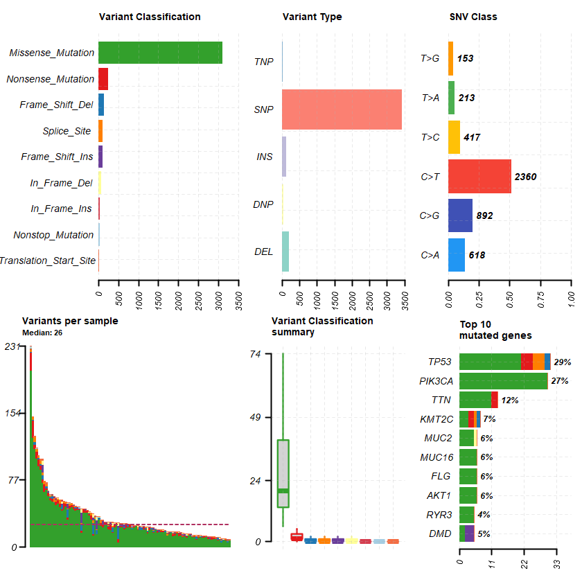
    


```R
genes %>% dplyr::filter(Hugo_Symbol %in% nrs)
```


<table class="dataframe">
<caption>A data.table: 3 × 13</caption>
<thead>
	<tr><th scope=col>Hugo_Symbol</th><th scope=col>Frame_Shift_Del</th><th scope=col>Frame_Shift_Ins</th><th scope=col>In_Frame_Del</th><th scope=col>In_Frame_Ins</th><th scope=col>Missense_Mutation</th><th scope=col>Nonsense_Mutation</th><th scope=col>Nonstop_Mutation</th><th scope=col>Splice_Site</th><th scope=col>Translation_Start_Site</th><th scope=col>total</th><th scope=col>MutatedSamples</th><th scope=col>AlteredSamples</th></tr>
	<tr><th scope=col>&lt;chr&gt;</th><th scope=col>&lt;int&gt;</th><th scope=col>&lt;int&gt;</th><th scope=col>&lt;int&gt;</th><th scope=col>&lt;int&gt;</th><th scope=col>&lt;int&gt;</th><th scope=col>&lt;int&gt;</th><th scope=col>&lt;int&gt;</th><th scope=col>&lt;int&gt;</th><th scope=col>&lt;int&gt;</th><th scope=col>&lt;dbl&gt;</th><th scope=col>&lt;int&gt;</th><th scope=col>&lt;int&gt;</th></tr>
</thead>
<tbody>
	<tr><td>ESR1</td><td>0</td><td>0</td><td>0</td><td>0</td><td>1</td><td>0</td><td>0</td><td>0</td><td>0</td><td>1</td><td>1</td><td>1</td></tr>
	<tr><td>PGR </td><td>0</td><td>1</td><td>0</td><td>0</td><td>0</td><td>0</td><td>0</td><td>0</td><td>0</td><td>1</td><td>1</td><td>1</td></tr>
	<tr><td>VDR </td><td>0</td><td>0</td><td>0</td><td>0</td><td>1</td><td>0</td><td>0</td><td>0</td><td>0</td><td>1</td><td>1</td><td>1</td></tr>
</tbody>
</table>


```R
sets = c("TTN", "TP53", "PIK3CA")
sts <- c(sets, nrs)
oncoplot(maf=df, genes = sts)
```


    
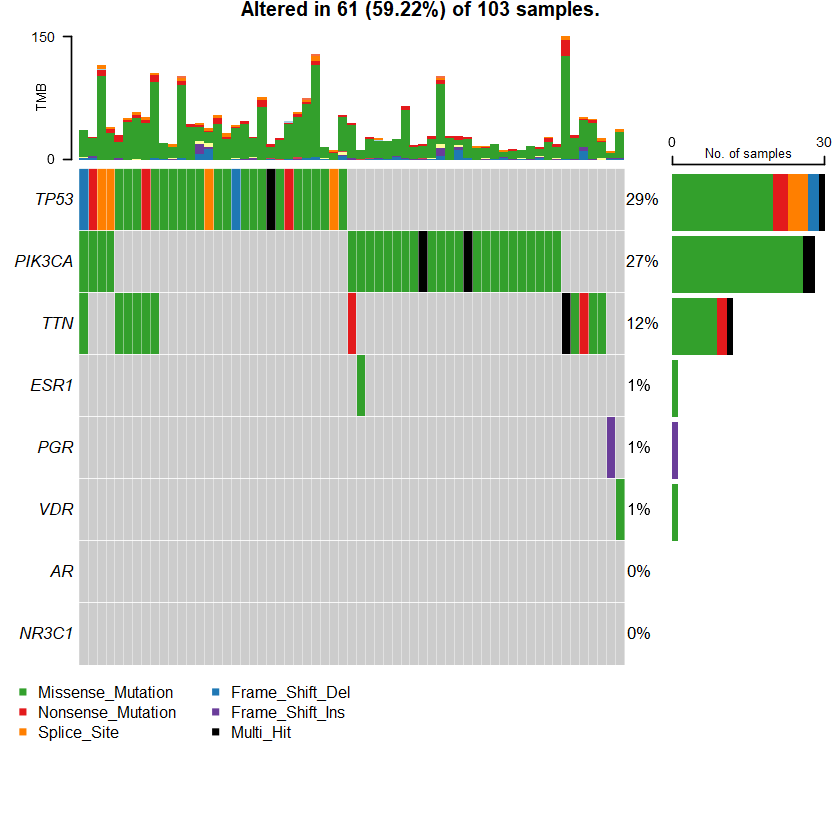
    


```R

```

## The landscape of cancer genes and mutational processes in breast cancer
[REF: 22722201](https://doi.org/10.1038/nature11017)
Breast Invasive Carcinoma (Sanger, Nature 2012)
Samples: 100


```R
df = read.maf(maf = "brca_sanger_data_mutations.txt")
samp = getSampleSummary(df)
head(samp, 10)
```

    -Reading
    -Validating
    -Silent variants: 1889 
    -Summarizing
    --Possible FLAGS among top ten genes:
      TTN
      MUC16
      SYNE1
    -Processing clinical data
    --Missing clinical data
    -Finished in 0.690s elapsed (0.500s cpu) 
    


<table class="dataframe">
<caption>A data.table: 10 × 11</caption>
<thead>
	<tr><th scope=col>Tumor_Sample_Barcode</th><th scope=col>Frame_Shift_Del</th><th scope=col>Frame_Shift_Ins</th><th scope=col>In_Frame_Del</th><th scope=col>In_Frame_Ins</th><th scope=col>Missense_Mutation</th><th scope=col>Nonsense_Mutation</th><th scope=col>Nonstop_Mutation</th><th scope=col>Splice_Site</th><th scope=col>Translation_Start_Site</th><th scope=col>total</th></tr>
	<tr><th scope=col>&lt;fct&gt;</th><th scope=col>&lt;int&gt;</th><th scope=col>&lt;int&gt;</th><th scope=col>&lt;int&gt;</th><th scope=col>&lt;int&gt;</th><th scope=col>&lt;int&gt;</th><th scope=col>&lt;int&gt;</th><th scope=col>&lt;int&gt;</th><th scope=col>&lt;int&gt;</th><th scope=col>&lt;int&gt;</th><th scope=col>&lt;dbl&gt;</th></tr>
</thead>
<tbody>
	<tr><td>PD4203a</td><td> 2</td><td>1</td><td>0</td><td>0</td><td>405</td><td>38</td><td>0</td><td>15</td><td>1</td><td>462</td></tr>
	<tr><td>PD4120a</td><td> 1</td><td>0</td><td>0</td><td>0</td><td>413</td><td>39</td><td>1</td><td> 5</td><td>0</td><td>459</td></tr>
	<tr><td>PD4937a</td><td> 0</td><td>1</td><td>0</td><td>0</td><td>319</td><td>21</td><td>0</td><td> 6</td><td>0</td><td>347</td></tr>
	<tr><td>PD4127a</td><td> 3</td><td>0</td><td>0</td><td>0</td><td>200</td><td>31</td><td>0</td><td> 2</td><td>0</td><td>236</td></tr>
	<tr><td>PD4100a</td><td>22</td><td>2</td><td>3</td><td>0</td><td>151</td><td> 9</td><td>1</td><td> 8</td><td>1</td><td>197</td></tr>
	<tr><td>PD4601a</td><td> 1</td><td>1</td><td>0</td><td>1</td><td>133</td><td>17</td><td>0</td><td> 2</td><td>0</td><td>155</td></tr>
	<tr><td>PD4119a</td><td> 0</td><td>0</td><td>0</td><td>0</td><td>133</td><td>14</td><td>0</td><td> 5</td><td>0</td><td>152</td></tr>
	<tr><td>PD4596a</td><td> 1</td><td>0</td><td>1</td><td>0</td><td>111</td><td>15</td><td>0</td><td> 3</td><td>0</td><td>131</td></tr>
	<tr><td>PD4123a</td><td> 2</td><td>0</td><td>1</td><td>0</td><td>100</td><td> 6</td><td>0</td><td> 4</td><td>0</td><td>113</td></tr>
	<tr><td>PD4844a</td><td> 6</td><td>0</td><td>3</td><td>0</td><td> 95</td><td> 7</td><td>0</td><td> 2</td><td>0</td><td>113</td></tr>
</tbody>
</table>


```R
genes = getGeneSummary(df)
head(genes,10)
```


<table class="dataframe">
<caption>A data.table: 10 × 13</caption>
<thead>
	<tr><th scope=col>Hugo_Symbol</th><th scope=col>Frame_Shift_Del</th><th scope=col>Frame_Shift_Ins</th><th scope=col>In_Frame_Del</th><th scope=col>In_Frame_Ins</th><th scope=col>Missense_Mutation</th><th scope=col>Nonsense_Mutation</th><th scope=col>Nonstop_Mutation</th><th scope=col>Splice_Site</th><th scope=col>Translation_Start_Site</th><th scope=col>total</th><th scope=col>MutatedSamples</th><th scope=col>AlteredSamples</th></tr>
	<tr><th scope=col>&lt;chr&gt;</th><th scope=col>&lt;int&gt;</th><th scope=col>&lt;int&gt;</th><th scope=col>&lt;int&gt;</th><th scope=col>&lt;int&gt;</th><th scope=col>&lt;int&gt;</th><th scope=col>&lt;int&gt;</th><th scope=col>&lt;int&gt;</th><th scope=col>&lt;int&gt;</th><th scope=col>&lt;int&gt;</th><th scope=col>&lt;dbl&gt;</th><th scope=col>&lt;int&gt;</th><th scope=col>&lt;int&gt;</th></tr>
</thead>
<tbody>
	<tr><td>TP53  </td><td>6</td><td> 0</td><td>2</td><td>1</td><td>20</td><td>6</td><td>0</td><td>3</td><td>0</td><td>38</td><td>37</td><td>37</td></tr>
	<tr><td>PIK3CA</td><td>0</td><td> 0</td><td>1</td><td>0</td><td>33</td><td>0</td><td>0</td><td>0</td><td>0</td><td>34</td><td>30</td><td>30</td></tr>
	<tr><td>TTN   </td><td>0</td><td> 1</td><td>1</td><td>0</td><td>27</td><td>2</td><td>0</td><td>1</td><td>0</td><td>32</td><td>26</td><td>26</td></tr>
	<tr><td>GATA3 </td><td>1</td><td>13</td><td>0</td><td>0</td><td> 1</td><td>0</td><td>0</td><td>1</td><td>0</td><td>16</td><td>15</td><td>15</td></tr>
	<tr><td>MLL3  </td><td>1</td><td> 2</td><td>0</td><td>0</td><td> 7</td><td>2</td><td>0</td><td>1</td><td>0</td><td>13</td><td>11</td><td>11</td></tr>
	<tr><td>MUC16 </td><td>0</td><td> 0</td><td>0</td><td>0</td><td> 9</td><td>1</td><td>0</td><td>0</td><td>0</td><td>10</td><td>10</td><td>10</td></tr>
	<tr><td>CDH1  </td><td>4</td><td> 0</td><td>0</td><td>0</td><td> 3</td><td>3</td><td>0</td><td>0</td><td>0</td><td>10</td><td> 8</td><td> 8</td></tr>
	<tr><td>FSIP2 </td><td>0</td><td> 0</td><td>0</td><td>0</td><td> 6</td><td>2</td><td>0</td><td>0</td><td>0</td><td> 8</td><td> 7</td><td> 7</td></tr>
	<tr><td>SYNE1 </td><td>0</td><td> 0</td><td>0</td><td>0</td><td> 7</td><td>1</td><td>0</td><td>0</td><td>0</td><td> 8</td><td> 7</td><td> 7</td></tr>
	<tr><td>BIRC6 </td><td>0</td><td> 0</td><td>0</td><td>0</td><td> 7</td><td>0</td><td>0</td><td>0</td><td>0</td><td> 7</td><td> 7</td><td> 7</td></tr>
</tbody>
</table>


```R
plotmafSummary(maf = df, rmOutlier = TRUE, addStat = 'median', dashboard = TRUE, titvRaw = FALSE)
```


    
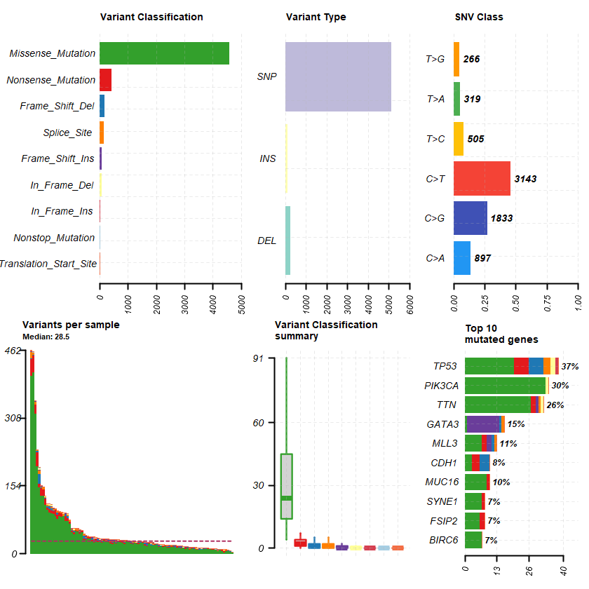
    


```R
genes %>% dplyr::filter(Hugo_Symbol %in% nrs)
```


<table class="dataframe">
<caption>A data.table: 2 × 13</caption>
<thead>
	<tr><th scope=col>Hugo_Symbol</th><th scope=col>Frame_Shift_Del</th><th scope=col>Frame_Shift_Ins</th><th scope=col>In_Frame_Del</th><th scope=col>In_Frame_Ins</th><th scope=col>Missense_Mutation</th><th scope=col>Nonsense_Mutation</th><th scope=col>Nonstop_Mutation</th><th scope=col>Splice_Site</th><th scope=col>Translation_Start_Site</th><th scope=col>total</th><th scope=col>MutatedSamples</th><th scope=col>AlteredSamples</th></tr>
	<tr><th scope=col>&lt;chr&gt;</th><th scope=col>&lt;int&gt;</th><th scope=col>&lt;int&gt;</th><th scope=col>&lt;int&gt;</th><th scope=col>&lt;int&gt;</th><th scope=col>&lt;int&gt;</th><th scope=col>&lt;int&gt;</th><th scope=col>&lt;int&gt;</th><th scope=col>&lt;int&gt;</th><th scope=col>&lt;int&gt;</th><th scope=col>&lt;dbl&gt;</th><th scope=col>&lt;int&gt;</th><th scope=col>&lt;int&gt;</th></tr>
</thead>
<tbody>
	<tr><td>AR </td><td>0</td><td>0</td><td>0</td><td>0</td><td>1</td><td>0</td><td>0</td><td>0</td><td>0</td><td>1</td><td>1</td><td>1</td></tr>
	<tr><td>PGR</td><td>0</td><td>0</td><td>0</td><td>0</td><td>1</td><td>0</td><td>0</td><td>0</td><td>0</td><td>1</td><td>1</td><td>1</td></tr>
</tbody>
</table>


```R
sets = c("TTN", "TP53", "PIK3CA")
sts <- c(sets, nrs)
oncoplot(maf=df, genes = sts)
```


    
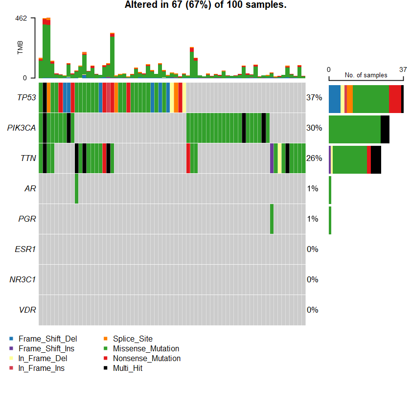
    


```R

```

## PIK3CA and MAP3K1 alterations imply luminal A status and are associated with clinical benefit from pan-PI3K inhibitor buparlisib and letrozole in ER+ metastatic breast cancer
[REF: 31552290](https://doi.org/10.1038/s41523-019-0126-6)
Breast Cancer (MSK, NPJ Breast Cancer 2019)

Samples : 70


```R
df = read.maf(maf = "brca_mskcc_2019_data_mutations.txt")
samp = getSampleSummary(df)
head(samp, 10)
```

    -Reading
    -Validating
    --Removed 1 duplicated variants
    -Silent variants: 2 
    -Summarizing
    --Mutiple centers found
    MSK-IMPACT341;MSK-IMPACT-Processing clinical data
    --Missing clinical data
    -Finished in 0.160s elapsed (0.070s cpu) 
    


<table class="dataframe">
<caption>A data.table: 10 × 10</caption>
<thead>
	<tr><th scope=col>Tumor_Sample_Barcode</th><th scope=col>Frame_Shift_Del</th><th scope=col>Frame_Shift_Ins</th><th scope=col>In_Frame_Del</th><th scope=col>In_Frame_Ins</th><th scope=col>Missense_Mutation</th><th scope=col>Nonsense_Mutation</th><th scope=col>Splice_Site</th><th scope=col>Translation_Start_Site</th><th scope=col>total</th></tr>
	<tr><th scope=col>&lt;fct&gt;</th><th scope=col>&lt;int&gt;</th><th scope=col>&lt;int&gt;</th><th scope=col>&lt;int&gt;</th><th scope=col>&lt;int&gt;</th><th scope=col>&lt;int&gt;</th><th scope=col>&lt;int&gt;</th><th scope=col>&lt;int&gt;</th><th scope=col>&lt;int&gt;</th><th scope=col>&lt;dbl&gt;</th></tr>
</thead>
<tbody>
	<tr><td>s_DS_bkm_057_T </td><td>0</td><td>1</td><td>0</td><td>0</td><td>21</td><td>2</td><td>0</td><td>0</td><td>24</td></tr>
	<tr><td>s_DS_bkm_081_T </td><td>0</td><td>0</td><td>0</td><td>0</td><td>23</td><td>1</td><td>0</td><td>0</td><td>24</td></tr>
	<tr><td>s_DS_bkm_067_T </td><td>0</td><td>2</td><td>1</td><td>0</td><td>16</td><td>2</td><td>0</td><td>0</td><td>21</td></tr>
	<tr><td>s_DS_bkm_078_T1</td><td>0</td><td>0</td><td>0</td><td>1</td><td>15</td><td>3</td><td>0</td><td>0</td><td>19</td></tr>
	<tr><td>s_DS_bkm_078_T2</td><td>0</td><td>0</td><td>0</td><td>1</td><td>15</td><td>3</td><td>0</td><td>0</td><td>19</td></tr>
	<tr><td>s_DS_bkm_065_T </td><td>2</td><td>1</td><td>0</td><td>1</td><td>13</td><td>0</td><td>0</td><td>0</td><td>17</td></tr>
	<tr><td>s_DS_bkm_020_T </td><td>1</td><td>0</td><td>0</td><td>0</td><td>11</td><td>4</td><td>0</td><td>0</td><td>16</td></tr>
	<tr><td>s_DS_bkm_061_T </td><td>0</td><td>0</td><td>0</td><td>0</td><td>14</td><td>0</td><td>1</td><td>1</td><td>16</td></tr>
	<tr><td>s_DS_bkm_073_T </td><td>2</td><td>0</td><td>0</td><td>0</td><td>14</td><td>0</td><td>0</td><td>0</td><td>16</td></tr>
	<tr><td>s_DS_bkm_076_T </td><td>0</td><td>0</td><td>0</td><td>0</td><td>15</td><td>0</td><td>0</td><td>0</td><td>15</td></tr>
</tbody>
</table>


```R
genes = getGeneSummary(df)
head(genes,10)
```


<table class="dataframe">
<caption>A data.table: 10 × 12</caption>
<thead>
	<tr><th scope=col>Hugo_Symbol</th><th scope=col>Frame_Shift_Del</th><th scope=col>Frame_Shift_Ins</th><th scope=col>In_Frame_Del</th><th scope=col>In_Frame_Ins</th><th scope=col>Missense_Mutation</th><th scope=col>Nonsense_Mutation</th><th scope=col>Splice_Site</th><th scope=col>Translation_Start_Site</th><th scope=col>total</th><th scope=col>MutatedSamples</th><th scope=col>AlteredSamples</th></tr>
	<tr><th scope=col>&lt;chr&gt;</th><th scope=col>&lt;int&gt;</th><th scope=col>&lt;int&gt;</th><th scope=col>&lt;int&gt;</th><th scope=col>&lt;int&gt;</th><th scope=col>&lt;int&gt;</th><th scope=col>&lt;int&gt;</th><th scope=col>&lt;int&gt;</th><th scope=col>&lt;int&gt;</th><th scope=col>&lt;dbl&gt;</th><th scope=col>&lt;int&gt;</th><th scope=col>&lt;int&gt;</th></tr>
</thead>
<tbody>
	<tr><td>PIK3CA</td><td>0</td><td>1</td><td>1</td><td>0</td><td>40</td><td>0</td><td>0</td><td>0</td><td>42</td><td>35</td><td>35</td></tr>
	<tr><td>TP53  </td><td>0</td><td>1</td><td>0</td><td>0</td><td>20</td><td>2</td><td>1</td><td>0</td><td>24</td><td>22</td><td>22</td></tr>
	<tr><td>ATM   </td><td>0</td><td>0</td><td>0</td><td>0</td><td>18</td><td>0</td><td>1</td><td>0</td><td>19</td><td>16</td><td>16</td></tr>
	<tr><td>CDH1  </td><td>4</td><td>3</td><td>0</td><td>0</td><td> 3</td><td>5</td><td>1</td><td>0</td><td>16</td><td>15</td><td>15</td></tr>
	<tr><td>MAP3K1</td><td>6</td><td>1</td><td>0</td><td>0</td><td> 8</td><td>3</td><td>0</td><td>0</td><td>18</td><td>13</td><td>13</td></tr>
	<tr><td>GATA3 </td><td>3</td><td>6</td><td>1</td><td>0</td><td> 3</td><td>0</td><td>0</td><td>0</td><td>13</td><td>12</td><td>12</td></tr>
	<tr><td>KMT2C </td><td>4</td><td>0</td><td>0</td><td>0</td><td> 6</td><td>3</td><td>0</td><td>0</td><td>13</td><td>12</td><td>12</td></tr>
	<tr><td>NOTCH2</td><td>6</td><td>0</td><td>0</td><td>0</td><td>14</td><td>0</td><td>0</td><td>0</td><td>20</td><td>10</td><td>10</td></tr>
	<tr><td>ERBB2 </td><td>0</td><td>0</td><td>0</td><td>0</td><td>10</td><td>0</td><td>0</td><td>0</td><td>10</td><td>10</td><td>10</td></tr>
	<tr><td>MDC1  </td><td>0</td><td>0</td><td>1</td><td>0</td><td> 7</td><td>1</td><td>0</td><td>0</td><td> 9</td><td> 9</td><td> 9</td></tr>
</tbody>
</table>


```R
plotmafSummary(maf = df, rmOutlier = TRUE, addStat = 'median', dashboard = TRUE, titvRaw = FALSE)
```


    
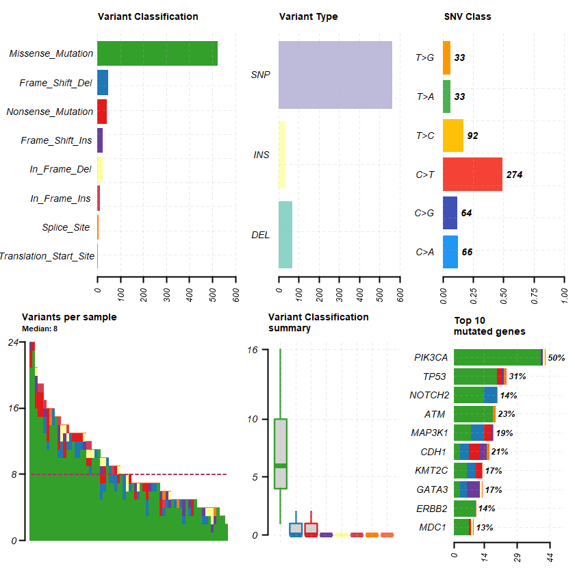
    


```R
genes %>% dplyr::filter(Hugo_Symbol %in% nrs)
```


<table class="dataframe">
<caption>A data.table: 2 × 12</caption>
<thead>
	<tr><th scope=col>Hugo_Symbol</th><th scope=col>Frame_Shift_Del</th><th scope=col>Frame_Shift_Ins</th><th scope=col>In_Frame_Del</th><th scope=col>In_Frame_Ins</th><th scope=col>Missense_Mutation</th><th scope=col>Nonsense_Mutation</th><th scope=col>Splice_Site</th><th scope=col>Translation_Start_Site</th><th scope=col>total</th><th scope=col>MutatedSamples</th><th scope=col>AlteredSamples</th></tr>
	<tr><th scope=col>&lt;chr&gt;</th><th scope=col>&lt;int&gt;</th><th scope=col>&lt;int&gt;</th><th scope=col>&lt;int&gt;</th><th scope=col>&lt;int&gt;</th><th scope=col>&lt;int&gt;</th><th scope=col>&lt;int&gt;</th><th scope=col>&lt;int&gt;</th><th scope=col>&lt;int&gt;</th><th scope=col>&lt;dbl&gt;</th><th scope=col>&lt;int&gt;</th><th scope=col>&lt;int&gt;</th></tr>
</thead>
<tbody>
	<tr><td>ESR1</td><td>0</td><td>0</td><td>0</td><td>0</td><td>6</td><td>0</td><td>0</td><td>0</td><td>6</td><td>5</td><td>5</td></tr>
	<tr><td>AR  </td><td>0</td><td>0</td><td>1</td><td>0</td><td>0</td><td>0</td><td>0</td><td>0</td><td>1</td><td>1</td><td>1</td></tr>
</tbody>
</table>


```R
sets = c("ATM", "TP53", "PIK3CA")
sts <- c(sets, nrs)
oncoplot(maf=df, genes = sts)
```


    
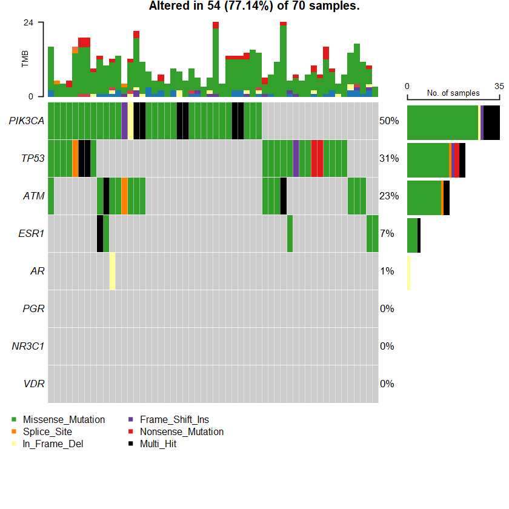
    


```R

```

## The clonal and mutational evolution spectrum of primary triple-negative breast cancers
[REF: 22495314](https://doi.org/10.1038/nature10933)
Breast Invasive Carcinoma (British Columbia, Nature 2012)

Samples : 65


```R
df = read.maf(maf = "brca_bccrc_data_mutations.txt")
samp = getSampleSummary(df)
head(samp, 10)
```

    -Reading
    -Validating
    -Silent variants: 29 
    -Summarizing
    --Mutiple centers found
    BC;--Possible FLAGS among top ten genes:
      USH2A
    -Processing clinical data
    --Missing clinical data
    -Finished in 0.370s elapsed (0.260s cpu) 
    


<table class="dataframe">
<caption>A data.table: 10 × 10</caption>
<thead>
	<tr><th scope=col>Tumor_Sample_Barcode</th><th scope=col>Frame_Shift_Del</th><th scope=col>Frame_Shift_Ins</th><th scope=col>In_Frame_Del</th><th scope=col>In_Frame_Ins</th><th scope=col>Missense_Mutation</th><th scope=col>Nonsense_Mutation</th><th scope=col>Nonstop_Mutation</th><th scope=col>Splice_Site</th><th scope=col>total</th></tr>
	<tr><th scope=col>&lt;fct&gt;</th><th scope=col>&lt;int&gt;</th><th scope=col>&lt;int&gt;</th><th scope=col>&lt;int&gt;</th><th scope=col>&lt;int&gt;</th><th scope=col>&lt;int&gt;</th><th scope=col>&lt;int&gt;</th><th scope=col>&lt;int&gt;</th><th scope=col>&lt;int&gt;</th><th scope=col>&lt;dbl&gt;</th></tr>
</thead>
<tbody>
	<tr><td>SA214</td><td> 0</td><td>0</td><td>0</td><td>0</td><td>174</td><td>18</td><td>0</td><td>1</td><td>193</td></tr>
	<tr><td>SA106</td><td> 4</td><td>2</td><td>2</td><td>0</td><td>116</td><td> 3</td><td>0</td><td>5</td><td>132</td></tr>
	<tr><td>SA218</td><td> 7</td><td>1</td><td>1</td><td>0</td><td>111</td><td> 6</td><td>0</td><td>0</td><td>126</td></tr>
	<tr><td>SA065</td><td>15</td><td>0</td><td>6</td><td>0</td><td> 85</td><td> 9</td><td>0</td><td>1</td><td>116</td></tr>
	<tr><td>SA071</td><td> 1</td><td>0</td><td>0</td><td>0</td><td> 86</td><td> 1</td><td>0</td><td>4</td><td> 92</td></tr>
	<tr><td>SA054</td><td> 2</td><td>0</td><td>0</td><td>0</td><td> 65</td><td> 3</td><td>0</td><td>4</td><td> 74</td></tr>
	<tr><td>SA077</td><td> 0</td><td>0</td><td>1</td><td>0</td><td> 64</td><td> 5</td><td>0</td><td>0</td><td> 70</td></tr>
	<tr><td>SA031</td><td> 1</td><td>0</td><td>0</td><td>0</td><td> 61</td><td> 2</td><td>0</td><td>1</td><td> 65</td></tr>
	<tr><td>SA084</td><td> 0</td><td>1</td><td>0</td><td>0</td><td> 52</td><td>10</td><td>0</td><td>0</td><td> 63</td></tr>
	<tr><td>SA225</td><td> 2</td><td>0</td><td>2</td><td>0</td><td> 52</td><td> 7</td><td>0</td><td>0</td><td> 63</td></tr>
</tbody>
</table>


```R
genes = getGeneSummary(df)
head(genes,10)
```


<table class="dataframe">
<caption>A data.table: 10 × 12</caption>
<thead>
	<tr><th scope=col>Hugo_Symbol</th><th scope=col>Frame_Shift_Del</th><th scope=col>Frame_Shift_Ins</th><th scope=col>In_Frame_Del</th><th scope=col>In_Frame_Ins</th><th scope=col>Missense_Mutation</th><th scope=col>Nonsense_Mutation</th><th scope=col>Nonstop_Mutation</th><th scope=col>Splice_Site</th><th scope=col>total</th><th scope=col>MutatedSamples</th><th scope=col>AlteredSamples</th></tr>
	<tr><th scope=col>&lt;chr&gt;</th><th scope=col>&lt;int&gt;</th><th scope=col>&lt;int&gt;</th><th scope=col>&lt;int&gt;</th><th scope=col>&lt;int&gt;</th><th scope=col>&lt;int&gt;</th><th scope=col>&lt;int&gt;</th><th scope=col>&lt;int&gt;</th><th scope=col>&lt;int&gt;</th><th scope=col>&lt;dbl&gt;</th><th scope=col>&lt;int&gt;</th><th scope=col>&lt;int&gt;</th></tr>
</thead>
<tbody>
	<tr><td>TP53  </td><td>1</td><td>0</td><td>0</td><td>0</td><td>23</td><td>8</td><td>0</td><td>3</td><td>35</td><td>35</td><td>35</td></tr>
	<tr><td>PIK3CA</td><td>0</td><td>0</td><td>1</td><td>0</td><td> 6</td><td>0</td><td>0</td><td>0</td><td> 7</td><td> 7</td><td> 7</td></tr>
	<tr><td>USH2A </td><td>0</td><td>0</td><td>0</td><td>0</td><td> 7</td><td>0</td><td>0</td><td>0</td><td> 7</td><td> 6</td><td> 6</td></tr>
	<tr><td>MYO3A </td><td>0</td><td>0</td><td>0</td><td>0</td><td> 5</td><td>1</td><td>0</td><td>0</td><td> 6</td><td> 6</td><td> 6</td></tr>
	<tr><td>PTEN  </td><td>2</td><td>0</td><td>0</td><td>0</td><td> 4</td><td>0</td><td>0</td><td>0</td><td> 6</td><td> 5</td><td> 5</td></tr>
	<tr><td>ATR   </td><td>1</td><td>0</td><td>0</td><td>0</td><td> 4</td><td>0</td><td>0</td><td>0</td><td> 5</td><td> 4</td><td> 4</td></tr>
	<tr><td>COL6A3</td><td>0</td><td>0</td><td>0</td><td>0</td><td> 3</td><td>1</td><td>0</td><td>0</td><td> 4</td><td> 4</td><td> 4</td></tr>
	<tr><td>GPR112</td><td>0</td><td>0</td><td>0</td><td>0</td><td> 4</td><td>0</td><td>0</td><td>0</td><td> 4</td><td> 4</td><td> 4</td></tr>
	<tr><td>LRP2  </td><td>0</td><td>0</td><td>0</td><td>0</td><td> 4</td><td>0</td><td>0</td><td>0</td><td> 4</td><td> 4</td><td> 4</td></tr>
	<tr><td>MDN1  </td><td>0</td><td>0</td><td>0</td><td>0</td><td> 3</td><td>1</td><td>0</td><td>0</td><td> 4</td><td> 4</td><td> 4</td></tr>
</tbody>
</table>


```R
plotmafSummary(maf = df, rmOutlier = TRUE, addStat = 'median', dashboard = TRUE, titvRaw = FALSE)
```


    

    


```R
genes %>% dplyr::filter(Hugo_Symbol %in% nrs)
```


<table class="dataframe">
<caption>A data.table: 1 × 12</caption>
<thead>
	<tr><th scope=col>Hugo_Symbol</th><th scope=col>Frame_Shift_Del</th><th scope=col>Frame_Shift_Ins</th><th scope=col>In_Frame_Del</th><th scope=col>In_Frame_Ins</th><th scope=col>Missense_Mutation</th><th scope=col>Nonsense_Mutation</th><th scope=col>Nonstop_Mutation</th><th scope=col>Splice_Site</th><th scope=col>total</th><th scope=col>MutatedSamples</th><th scope=col>AlteredSamples</th></tr>
	<tr><th scope=col>&lt;chr&gt;</th><th scope=col>&lt;int&gt;</th><th scope=col>&lt;int&gt;</th><th scope=col>&lt;int&gt;</th><th scope=col>&lt;int&gt;</th><th scope=col>&lt;int&gt;</th><th scope=col>&lt;int&gt;</th><th scope=col>&lt;int&gt;</th><th scope=col>&lt;int&gt;</th><th scope=col>&lt;dbl&gt;</th><th scope=col>&lt;int&gt;</th><th scope=col>&lt;int&gt;</th></tr>
</thead>
<tbody>
	<tr><td>NR3C1</td><td>1</td><td>0</td><td>0</td><td>0</td><td>2</td><td>0</td><td>0</td><td>0</td><td>3</td><td>3</td><td>3</td></tr>
</tbody>
</table>


```R
sets = c("USH2A", "TP53", "PIK3CA")
sts <- c(sets, nrs)
oncoplot(maf=df, genes = sts)
```


    

    


```R

```

## Whole-Exome Sequencing Analysis of the Progression from Non-Low-Grade Ductal Carcinoma In Situ to Invasive Ductal Carcinoma
[REF: 32220886](https://doi.org/10.1158/1078-0432.ccr-19-2563)
Breast Cancer (MSK, Clinical Cancer Res 2020)

Samples: 60


```R
df = read.maf(maf = "brca_pareja_msk_2020_data_mutations.txt")
samp = getSampleSummary(df)
head(samp, 10)
```

    -Reading
    -Validating
    -Silent variants: 45 
    -Summarizing
    --Possible FLAGS among top ten genes:
      MUC16
      TTN
    -Processing clinical data
    --Missing clinical data
    -Finished in 0.400s elapsed (0.220s cpu) 
    


<table class="dataframe">
<caption>A data.table: 10 × 10</caption>
<thead>
	<tr><th scope=col>Tumor_Sample_Barcode</th><th scope=col>Frame_Shift_Del</th><th scope=col>Frame_Shift_Ins</th><th scope=col>In_Frame_Del</th><th scope=col>In_Frame_Ins</th><th scope=col>Missense_Mutation</th><th scope=col>Nonsense_Mutation</th><th scope=col>Nonstop_Mutation</th><th scope=col>Splice_Site</th><th scope=col>total</th></tr>
	<tr><th scope=col>&lt;fct&gt;</th><th scope=col>&lt;int&gt;</th><th scope=col>&lt;int&gt;</th><th scope=col>&lt;int&gt;</th><th scope=col>&lt;int&gt;</th><th scope=col>&lt;int&gt;</th><th scope=col>&lt;int&gt;</th><th scope=col>&lt;int&gt;</th><th scope=col>&lt;int&gt;</th><th scope=col>&lt;dbl&gt;</th></tr>
</thead>
<tbody>
	<tr><td>30DCIS</td><td> 1</td><td>0</td><td>0</td><td>0</td><td>265</td><td>34</td><td>2</td><td>3</td><td>305</td></tr>
	<tr><td>30IDC </td><td> 2</td><td>0</td><td>1</td><td>0</td><td>214</td><td>26</td><td>1</td><td>3</td><td>247</td></tr>
	<tr><td>25DCIS</td><td>11</td><td>0</td><td>3</td><td>0</td><td>156</td><td>16</td><td>1</td><td>2</td><td>189</td></tr>
	<tr><td>25IDC </td><td>11</td><td>0</td><td>2</td><td>0</td><td>150</td><td>14</td><td>1</td><td>2</td><td>180</td></tr>
	<tr><td>19IDC </td><td>11</td><td>0</td><td>4</td><td>0</td><td>112</td><td> 2</td><td>0</td><td>3</td><td>132</td></tr>
	<tr><td>21IDC </td><td> 3</td><td>0</td><td>1</td><td>0</td><td>110</td><td> 6</td><td>0</td><td>3</td><td>123</td></tr>
	<tr><td>23DCIS</td><td> 5</td><td>1</td><td>4</td><td>0</td><td>100</td><td> 8</td><td>0</td><td>4</td><td>122</td></tr>
	<tr><td>21DCIS</td><td> 4</td><td>0</td><td>1</td><td>0</td><td>100</td><td> 5</td><td>0</td><td>3</td><td>113</td></tr>
	<tr><td>2IDCA </td><td> 6</td><td>1</td><td>1</td><td>0</td><td> 95</td><td> 2</td><td>0</td><td>3</td><td>108</td></tr>
	<tr><td>23IDC </td><td> 4</td><td>1</td><td>2</td><td>0</td><td> 89</td><td> 7</td><td>0</td><td>4</td><td>107</td></tr>
</tbody>
</table>


```R
genes = getGeneSummary(df)
head(genes,10)
```


<table class="dataframe">
<caption>A data.table: 10 × 12</caption>
<thead>
	<tr><th scope=col>Hugo_Symbol</th><th scope=col>Frame_Shift_Del</th><th scope=col>Frame_Shift_Ins</th><th scope=col>In_Frame_Del</th><th scope=col>In_Frame_Ins</th><th scope=col>Missense_Mutation</th><th scope=col>Nonsense_Mutation</th><th scope=col>Nonstop_Mutation</th><th scope=col>Splice_Site</th><th scope=col>total</th><th scope=col>MutatedSamples</th><th scope=col>AlteredSamples</th></tr>
	<tr><th scope=col>&lt;chr&gt;</th><th scope=col>&lt;int&gt;</th><th scope=col>&lt;int&gt;</th><th scope=col>&lt;int&gt;</th><th scope=col>&lt;int&gt;</th><th scope=col>&lt;int&gt;</th><th scope=col>&lt;int&gt;</th><th scope=col>&lt;int&gt;</th><th scope=col>&lt;int&gt;</th><th scope=col>&lt;dbl&gt;</th><th scope=col>&lt;int&gt;</th><th scope=col>&lt;int&gt;</th></tr>
</thead>
<tbody>
	<tr><td>TP53    </td><td>4</td><td>4</td><td>2</td><td>1</td><td>13</td><td>4</td><td>0</td><td>1</td><td>29</td><td>29</td><td>29</td></tr>
	<tr><td>PIK3CA  </td><td>0</td><td>2</td><td>0</td><td>0</td><td>22</td><td>0</td><td>0</td><td>0</td><td>24</td><td>22</td><td>22</td></tr>
	<tr><td>GATA3   </td><td>3</td><td>8</td><td>0</td><td>0</td><td> 1</td><td>1</td><td>0</td><td>2</td><td>15</td><td>15</td><td>15</td></tr>
	<tr><td>MUC16   </td><td>0</td><td>0</td><td>0</td><td>0</td><td> 9</td><td>0</td><td>0</td><td>0</td><td> 9</td><td> 9</td><td> 9</td></tr>
	<tr><td>AGGF1   </td><td>0</td><td>0</td><td>0</td><td>0</td><td> 8</td><td>0</td><td>0</td><td>0</td><td> 8</td><td> 8</td><td> 8</td></tr>
	<tr><td>TTN     </td><td>0</td><td>0</td><td>0</td><td>0</td><td> 9</td><td>0</td><td>0</td><td>0</td><td> 9</td><td> 7</td><td> 7</td></tr>
	<tr><td>CDC27   </td><td>0</td><td>0</td><td>0</td><td>0</td><td> 6</td><td>2</td><td>0</td><td>0</td><td> 8</td><td> 7</td><td> 7</td></tr>
	<tr><td>CCAR1   </td><td>3</td><td>0</td><td>0</td><td>0</td><td> 0</td><td>4</td><td>0</td><td>0</td><td> 7</td><td> 7</td><td> 7</td></tr>
	<tr><td>KIF5A   </td><td>0</td><td>0</td><td>0</td><td>0</td><td> 7</td><td>0</td><td>0</td><td>0</td><td> 7</td><td> 7</td><td> 7</td></tr>
	<tr><td>ARHGAP22</td><td>0</td><td>0</td><td>2</td><td>0</td><td> 2</td><td>2</td><td>0</td><td>0</td><td> 6</td><td> 6</td><td> 6</td></tr>
</tbody>
</table>


```R
plotmafSummary(maf = df, rmOutlier = TRUE, addStat = 'median', dashboard = TRUE, titvRaw = FALSE)
```


    
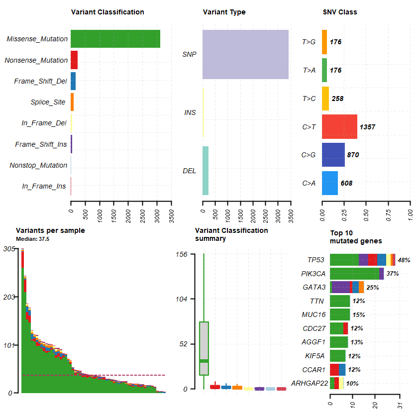
    


```R
genes %>% dplyr::filter(Hugo_Symbol %in% nrs)
```


<table class="dataframe">
<caption>A data.table: 0 × 12</caption>
<thead>
	<tr><th scope=col>Hugo_Symbol</th><th scope=col>Frame_Shift_Del</th><th scope=col>Frame_Shift_Ins</th><th scope=col>In_Frame_Del</th><th scope=col>In_Frame_Ins</th><th scope=col>Missense_Mutation</th><th scope=col>Nonsense_Mutation</th><th scope=col>Nonstop_Mutation</th><th scope=col>Splice_Site</th><th scope=col>total</th><th scope=col>MutatedSamples</th><th scope=col>AlteredSamples</th></tr>
	<tr><th scope=col>&lt;chr&gt;</th><th scope=col>&lt;int&gt;</th><th scope=col>&lt;int&gt;</th><th scope=col>&lt;int&gt;</th><th scope=col>&lt;int&gt;</th><th scope=col>&lt;int&gt;</th><th scope=col>&lt;int&gt;</th><th scope=col>&lt;int&gt;</th><th scope=col>&lt;int&gt;</th><th scope=col>&lt;dbl&gt;</th><th scope=col>&lt;int&gt;</th><th scope=col>&lt;int&gt;</th></tr>
</thead>
<tbody>
</tbody>
</table>


```R
sets = c("GATA3", "TP53", "PIK3CA")
sts <- c(sets, nrs)
oncoplot(maf=df, genes = sts)
```


    
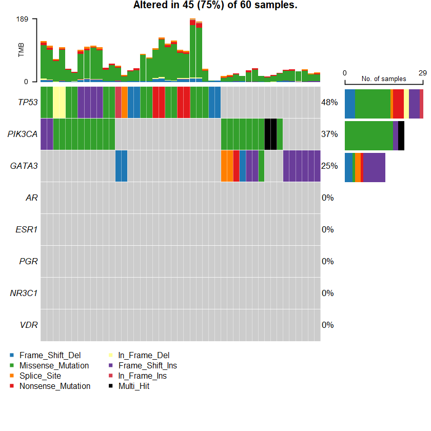
    


```R

```


```R

```

## The Metastatic Breast Cancer Project (Provisional, December 2021)
Sample: 379


```R
df = read.maf(maf = "brca_mbcproject_2022_data_mutations.txt")
samp = getSampleSummary(df)
head(samp, 10)
```

    -Reading
    -Validating
    -Silent variants: 24952 
    -Summarizing
    --Possible FLAGS among top ten genes:
      TTN
      MUC16
      HMCN1
    -Processing clinical data
    --Missing clinical data
    -Finished in 3.280s elapsed (2.510s cpu) 
    


<table class="dataframe">
<caption>A data.table: 10 × 11</caption>
<thead>
	<tr><th scope=col>Tumor_Sample_Barcode</th><th scope=col>Frame_Shift_Del</th><th scope=col>Frame_Shift_Ins</th><th scope=col>In_Frame_Del</th><th scope=col>In_Frame_Ins</th><th scope=col>Missense_Mutation</th><th scope=col>Nonsense_Mutation</th><th scope=col>Nonstop_Mutation</th><th scope=col>Splice_Site</th><th scope=col>Translation_Start_Site</th><th scope=col>total</th></tr>
	<tr><th scope=col>&lt;fct&gt;</th><th scope=col>&lt;int&gt;</th><th scope=col>&lt;int&gt;</th><th scope=col>&lt;int&gt;</th><th scope=col>&lt;int&gt;</th><th scope=col>&lt;int&gt;</th><th scope=col>&lt;int&gt;</th><th scope=col>&lt;int&gt;</th><th scope=col>&lt;int&gt;</th><th scope=col>&lt;int&gt;</th><th scope=col>&lt;dbl&gt;</th></tr>
</thead>
<tbody>
	<tr><td>MBC-MBCProject_7wCjtKIW-Tumor-SM-GQCN4      </td><td>8</td><td>4</td><td>1</td><td>0</td><td>1076</td><td>123</td><td>0</td><td>10</td><td>2</td><td>1224</td></tr>
	<tr><td>MBC-MBCProject_57iLiJIl-Tumor-SM-CGLIV      </td><td>2</td><td>0</td><td>0</td><td>0</td><td> 650</td><td> 65</td><td>2</td><td> 8</td><td>4</td><td> 731</td></tr>
	<tr><td>RP-1156_MBCProject_JXUNUQI8_BLOOD_P_v1_Exome</td><td>1</td><td>0</td><td>1</td><td>0</td><td> 488</td><td> 60</td><td>0</td><td>15</td><td>0</td><td> 565</td></tr>
	<tr><td>RP-1156_MBCProject_rLt0uZhz_BLOOD_P_v1_Exome</td><td>1</td><td>1</td><td>1</td><td>0</td><td> 330</td><td> 31</td><td>2</td><td> 5</td><td>0</td><td> 371</td></tr>
	<tr><td>RP-1156_MBCProject_bBIxhQUD_BLOOD_P_v2_Exome</td><td>2</td><td>0</td><td>0</td><td>1</td><td> 314</td><td> 35</td><td>0</td><td> 5</td><td>1</td><td> 358</td></tr>
	<tr><td>MBC-MBCProject_K7f6fdUz-Tumor-SM-AZ5MA      </td><td>1</td><td>0</td><td>0</td><td>0</td><td> 311</td><td> 28</td><td>1</td><td> 6</td><td>0</td><td> 347</td></tr>
	<tr><td>RP-1156_MBCProject_0jUXcgsJ_BLOOD_P_v2_Exome</td><td>2</td><td>1</td><td>1</td><td>0</td><td> 288</td><td> 26</td><td>1</td><td> 5</td><td>0</td><td> 324</td></tr>
	<tr><td>RP-1156_MBCProject_W4FBsLSx_T3_v2_Exome     </td><td>3</td><td>5</td><td>1</td><td>0</td><td> 269</td><td> 28</td><td>0</td><td> 3</td><td>0</td><td> 309</td></tr>
	<tr><td>MBC-MBCProject_99CdCOHm-Tumor-SM-CGLF4      </td><td>1</td><td>2</td><td>0</td><td>0</td><td> 270</td><td>  2</td><td>1</td><td> 1</td><td>0</td><td> 277</td></tr>
	<tr><td>RP-1156_MBCProject_W4FBsLSx_T1_v2_Exome     </td><td>2</td><td>0</td><td>1</td><td>0</td><td> 242</td><td> 27</td><td>2</td><td> 1</td><td>1</td><td> 276</td></tr>
</tbody>
</table>


```R
genes = getGeneSummary(df)
head(genes,10)
```


<table class="dataframe">
<caption>A data.table: 10 × 13</caption>
<thead>
	<tr><th scope=col>Hugo_Symbol</th><th scope=col>Frame_Shift_Del</th><th scope=col>Frame_Shift_Ins</th><th scope=col>In_Frame_Del</th><th scope=col>In_Frame_Ins</th><th scope=col>Missense_Mutation</th><th scope=col>Nonsense_Mutation</th><th scope=col>Nonstop_Mutation</th><th scope=col>Splice_Site</th><th scope=col>Translation_Start_Site</th><th scope=col>total</th><th scope=col>MutatedSamples</th><th scope=col>AlteredSamples</th></tr>
	<tr><th scope=col>&lt;chr&gt;</th><th scope=col>&lt;int&gt;</th><th scope=col>&lt;int&gt;</th><th scope=col>&lt;int&gt;</th><th scope=col>&lt;int&gt;</th><th scope=col>&lt;int&gt;</th><th scope=col>&lt;int&gt;</th><th scope=col>&lt;int&gt;</th><th scope=col>&lt;int&gt;</th><th scope=col>&lt;int&gt;</th><th scope=col>&lt;dbl&gt;</th><th scope=col>&lt;int&gt;</th><th scope=col>&lt;int&gt;</th></tr>
</thead>
<tbody>
	<tr><td>TP53   </td><td>10</td><td> 7</td><td>4</td><td>0</td><td> 78</td><td>11</td><td>0</td><td>4</td><td>0</td><td>114</td><td>112</td><td>112</td></tr>
	<tr><td>TTN    </td><td> 1</td><td> 2</td><td>0</td><td>0</td><td> 90</td><td> 9</td><td>0</td><td>0</td><td>0</td><td>102</td><td> 81</td><td> 81</td></tr>
	<tr><td>PIK3CA </td><td> 0</td><td> 1</td><td>1</td><td>0</td><td> 76</td><td> 0</td><td>0</td><td>0</td><td>0</td><td> 78</td><td> 76</td><td> 76</td></tr>
	<tr><td>CDH1   </td><td>11</td><td> 5</td><td>0</td><td>0</td><td> 10</td><td>19</td><td>0</td><td>7</td><td>2</td><td> 54</td><td> 54</td><td> 54</td></tr>
	<tr><td>IGDCC4 </td><td> 0</td><td> 0</td><td>0</td><td>0</td><td>120</td><td> 0</td><td>0</td><td>0</td><td>0</td><td>120</td><td> 50</td><td> 50</td></tr>
	<tr><td>ESR1   </td><td> 0</td><td> 0</td><td>0</td><td>0</td><td> 49</td><td> 1</td><td>0</td><td>0</td><td>0</td><td> 50</td><td> 43</td><td> 43</td></tr>
	<tr><td>MUC16  </td><td> 0</td><td> 2</td><td>1</td><td>1</td><td> 39</td><td> 2</td><td>0</td><td>1</td><td>0</td><td> 46</td><td> 40</td><td> 40</td></tr>
	<tr><td>HMCN1  </td><td> 0</td><td> 3</td><td>0</td><td>0</td><td> 32</td><td> 1</td><td>0</td><td>3</td><td>0</td><td> 39</td><td> 38</td><td> 38</td></tr>
	<tr><td>ZKSCAN1</td><td> 0</td><td>34</td><td>0</td><td>0</td><td>  2</td><td> 2</td><td>0</td><td>0</td><td>0</td><td> 38</td><td> 37</td><td> 37</td></tr>
	<tr><td>GIMAP6 </td><td> 0</td><td> 0</td><td>0</td><td>0</td><td> 41</td><td> 3</td><td>0</td><td>0</td><td>0</td><td> 44</td><td> 36</td><td> 36</td></tr>
</tbody>
</table>


```R
plotmafSummary(maf = df, rmOutlier = TRUE, addStat = 'median', dashboard = TRUE, titvRaw = FALSE)
```


    
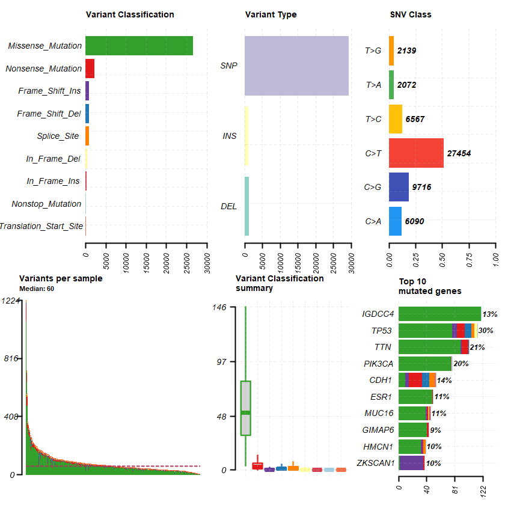
    


```R
genes %>% dplyr::filter(Hugo_Symbol %in% nrs)
```


<table class="dataframe">
<caption>A data.table: 4 × 13</caption>
<thead>
	<tr><th scope=col>Hugo_Symbol</th><th scope=col>Frame_Shift_Del</th><th scope=col>Frame_Shift_Ins</th><th scope=col>In_Frame_Del</th><th scope=col>In_Frame_Ins</th><th scope=col>Missense_Mutation</th><th scope=col>Nonsense_Mutation</th><th scope=col>Nonstop_Mutation</th><th scope=col>Splice_Site</th><th scope=col>Translation_Start_Site</th><th scope=col>total</th><th scope=col>MutatedSamples</th><th scope=col>AlteredSamples</th></tr>
	<tr><th scope=col>&lt;chr&gt;</th><th scope=col>&lt;int&gt;</th><th scope=col>&lt;int&gt;</th><th scope=col>&lt;int&gt;</th><th scope=col>&lt;int&gt;</th><th scope=col>&lt;int&gt;</th><th scope=col>&lt;int&gt;</th><th scope=col>&lt;int&gt;</th><th scope=col>&lt;int&gt;</th><th scope=col>&lt;int&gt;</th><th scope=col>&lt;dbl&gt;</th><th scope=col>&lt;int&gt;</th><th scope=col>&lt;int&gt;</th></tr>
</thead>
<tbody>
	<tr><td>ESR1 </td><td>0</td><td>0</td><td>0</td><td>0</td><td>49</td><td>1</td><td>0</td><td>0</td><td>0</td><td>50</td><td>43</td><td>43</td></tr>
	<tr><td>PGR  </td><td>0</td><td>0</td><td>0</td><td>0</td><td> 4</td><td>0</td><td>0</td><td>0</td><td>0</td><td> 4</td><td> 4</td><td> 4</td></tr>
	<tr><td>NR3C1</td><td>0</td><td>0</td><td>0</td><td>0</td><td> 1</td><td>0</td><td>0</td><td>1</td><td>0</td><td> 2</td><td> 2</td><td> 2</td></tr>
	<tr><td>VDR  </td><td>0</td><td>0</td><td>0</td><td>0</td><td> 0</td><td>1</td><td>0</td><td>0</td><td>0</td><td> 1</td><td> 1</td><td> 1</td></tr>
</tbody>
</table>


```R
sets = c("TTN", "TP53", "PIK3CA")
sts <- c(sets, nrs)
oncoplot(maf=df, genes = sts)
```


    
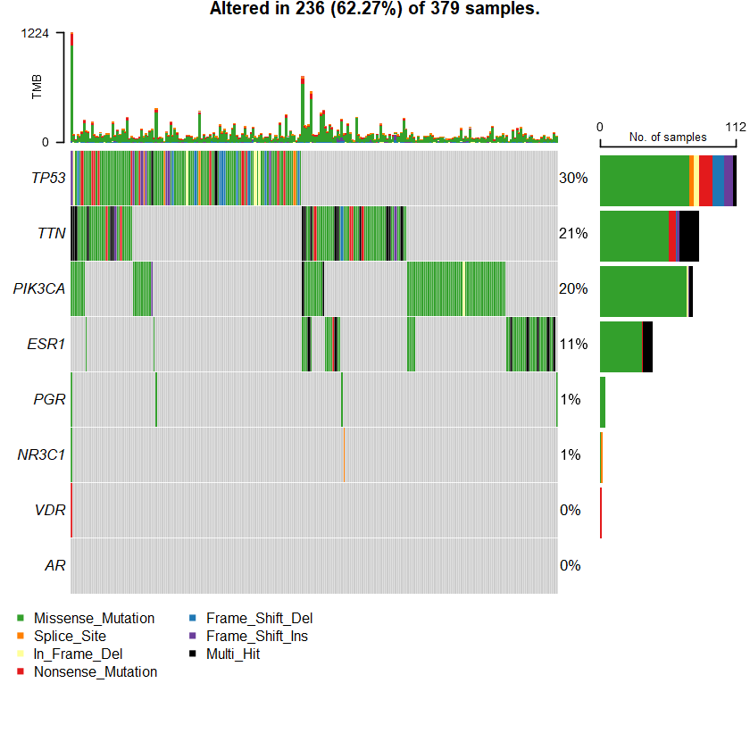
    


```R

```

## Mutational Profile of Metastatic Breast Cancers: A Retrospective Analysis
[REF: 28027327](https://doi.org/10.1371/journal.pmed.1002201)
Metastatic Breast Cancer (INSERM, PLoS Med 2016)
Samples: 216


```R
df = read.maf(maf = "brca_igr_2015_data_mutations.txt")
samp = getSampleSummary(df)
head(samp, 10)
```

    -Reading
    -Validating
    -Silent variants: 7046 
    -Summarizing
    --Possible FLAGS among top ten genes:
      TTN
      MUC16
    -Processing clinical data
    --Missing clinical data
    -Finished in 1.670s elapsed (1.170s cpu) 
    


<table class="dataframe">
<caption>A data.table: 10 × 10</caption>
<thead>
	<tr><th scope=col>Tumor_Sample_Barcode</th><th scope=col>Frame_Shift_Del</th><th scope=col>Frame_Shift_Ins</th><th scope=col>In_Frame_Ins</th><th scope=col>Missense_Mutation</th><th scope=col>Nonsense_Mutation</th><th scope=col>Nonstop_Mutation</th><th scope=col>Splice_Site</th><th scope=col>Translation_Start_Site</th><th scope=col>total</th></tr>
	<tr><th scope=col>&lt;fct&gt;</th><th scope=col>&lt;int&gt;</th><th scope=col>&lt;int&gt;</th><th scope=col>&lt;int&gt;</th><th scope=col>&lt;int&gt;</th><th scope=col>&lt;int&gt;</th><th scope=col>&lt;int&gt;</th><th scope=col>&lt;int&gt;</th><th scope=col>&lt;int&gt;</th><th scope=col>&lt;dbl&gt;</th></tr>
</thead>
<tbody>
	<tr><td>MBC_189</td><td>0</td><td> 8</td><td>0</td><td>769</td><td>79</td><td>4</td><td>10</td><td>0</td><td>870</td></tr>
	<tr><td>MBC_8  </td><td>0</td><td> 2</td><td>0</td><td>628</td><td>74</td><td>1</td><td> 4</td><td>2</td><td>711</td></tr>
	<tr><td>MBC_45 </td><td>0</td><td> 5</td><td>0</td><td>563</td><td>58</td><td>2</td><td>13</td><td>0</td><td>641</td></tr>
	<tr><td>MBC_71 </td><td>0</td><td> 8</td><td>1</td><td>396</td><td>48</td><td>1</td><td> 6</td><td>0</td><td>460</td></tr>
	<tr><td>MBC_82 </td><td>1</td><td> 7</td><td>0</td><td>379</td><td>50</td><td>0</td><td> 1</td><td>0</td><td>438</td></tr>
	<tr><td>MBC_207</td><td>0</td><td> 3</td><td>3</td><td>295</td><td>33</td><td>2</td><td> 4</td><td>5</td><td>345</td></tr>
	<tr><td>MBC_92 </td><td>0</td><td> 3</td><td>1</td><td>296</td><td>29</td><td>3</td><td> 8</td><td>0</td><td>340</td></tr>
	<tr><td>MBC_29 </td><td>0</td><td> 2</td><td>1</td><td>272</td><td>38</td><td>1</td><td> 6</td><td>0</td><td>320</td></tr>
	<tr><td>MBC_31 </td><td>0</td><td>10</td><td>1</td><td>234</td><td>23</td><td>0</td><td> 7</td><td>1</td><td>276</td></tr>
	<tr><td>MBC_145</td><td>0</td><td> 1</td><td>0</td><td>210</td><td>16</td><td>2</td><td> 3</td><td>0</td><td>232</td></tr>
</tbody>
</table>


```R
genes = getGeneSummary(df)
head(genes,10)
```


<table class="dataframe">
<caption>A data.table: 10 × 12</caption>
<thead>
	<tr><th scope=col>Hugo_Symbol</th><th scope=col>Frame_Shift_Del</th><th scope=col>Frame_Shift_Ins</th><th scope=col>In_Frame_Ins</th><th scope=col>Missense_Mutation</th><th scope=col>Nonsense_Mutation</th><th scope=col>Nonstop_Mutation</th><th scope=col>Splice_Site</th><th scope=col>Translation_Start_Site</th><th scope=col>total</th><th scope=col>MutatedSamples</th><th scope=col>AlteredSamples</th></tr>
	<tr><th scope=col>&lt;chr&gt;</th><th scope=col>&lt;int&gt;</th><th scope=col>&lt;int&gt;</th><th scope=col>&lt;int&gt;</th><th scope=col>&lt;int&gt;</th><th scope=col>&lt;int&gt;</th><th scope=col>&lt;int&gt;</th><th scope=col>&lt;int&gt;</th><th scope=col>&lt;int&gt;</th><th scope=col>&lt;dbl&gt;</th><th scope=col>&lt;int&gt;</th><th scope=col>&lt;int&gt;</th></tr>
</thead>
<tbody>
	<tr><td>TP53  </td><td>1</td><td>11</td><td>3</td><td>49</td><td>14</td><td>0</td><td>9</td><td>0</td><td>87</td><td>84</td><td>84</td></tr>
	<tr><td>PIK3CA</td><td>0</td><td> 2</td><td>4</td><td>67</td><td> 1</td><td>0</td><td>0</td><td>0</td><td>74</td><td>65</td><td>65</td></tr>
	<tr><td>TTN   </td><td>1</td><td> 1</td><td>2</td><td>44</td><td> 7</td><td>0</td><td>0</td><td>0</td><td>55</td><td>40</td><td>40</td></tr>
	<tr><td>GATA3 </td><td>0</td><td>18</td><td>0</td><td> 5</td><td> 1</td><td>0</td><td>0</td><td>0</td><td>24</td><td>22</td><td>22</td></tr>
	<tr><td>ESR1  </td><td>0</td><td> 0</td><td>2</td><td>21</td><td> 0</td><td>0</td><td>0</td><td>0</td><td>23</td><td>22</td><td>22</td></tr>
	<tr><td>RYR2  </td><td>0</td><td> 0</td><td>0</td><td>19</td><td> 3</td><td>0</td><td>1</td><td>0</td><td>23</td><td>19</td><td>19</td></tr>
	<tr><td>MAP3K1</td><td>0</td><td>15</td><td>0</td><td> 3</td><td> 6</td><td>0</td><td>0</td><td>0</td><td>24</td><td>18</td><td>18</td></tr>
	<tr><td>FSIP2 </td><td>0</td><td> 2</td><td>1</td><td>14</td><td> 0</td><td>0</td><td>0</td><td>0</td><td>17</td><td>16</td><td>16</td></tr>
	<tr><td>CDH1  </td><td>0</td><td>11</td><td>0</td><td> 1</td><td> 1</td><td>0</td><td>2</td><td>0</td><td>15</td><td>15</td><td>15</td></tr>
	<tr><td>MUC16 </td><td>0</td><td> 0</td><td>0</td><td>15</td><td> 3</td><td>0</td><td>0</td><td>0</td><td>18</td><td>14</td><td>14</td></tr>
</tbody>
</table>


```R
plotmafSummary(maf = df, rmOutlier = TRUE, addStat = 'median', dashboard = TRUE, titvRaw = FALSE)
```

    Warning message in titv(maf = maf, useSyn = TRUE, plot = FALSE):
    "Non standard Ti/Tv class: 4TRUE"
    


    
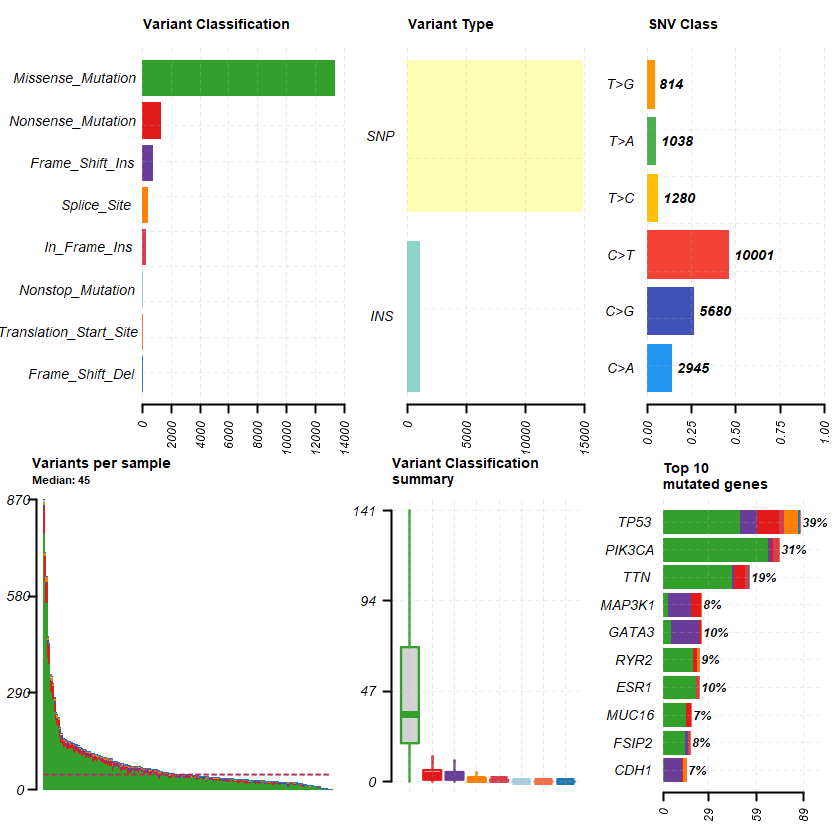
    


```R
genes %>% dplyr::filter(Hugo_Symbol %in% nrs)
```


<table class="dataframe">
<caption>A data.table: 3 × 12</caption>
<thead>
	<tr><th scope=col>Hugo_Symbol</th><th scope=col>Frame_Shift_Del</th><th scope=col>Frame_Shift_Ins</th><th scope=col>In_Frame_Ins</th><th scope=col>Missense_Mutation</th><th scope=col>Nonsense_Mutation</th><th scope=col>Nonstop_Mutation</th><th scope=col>Splice_Site</th><th scope=col>Translation_Start_Site</th><th scope=col>total</th><th scope=col>MutatedSamples</th><th scope=col>AlteredSamples</th></tr>
	<tr><th scope=col>&lt;chr&gt;</th><th scope=col>&lt;int&gt;</th><th scope=col>&lt;int&gt;</th><th scope=col>&lt;int&gt;</th><th scope=col>&lt;int&gt;</th><th scope=col>&lt;int&gt;</th><th scope=col>&lt;int&gt;</th><th scope=col>&lt;int&gt;</th><th scope=col>&lt;int&gt;</th><th scope=col>&lt;dbl&gt;</th><th scope=col>&lt;int&gt;</th><th scope=col>&lt;int&gt;</th></tr>
</thead>
<tbody>
	<tr><td>ESR1</td><td>0</td><td>0</td><td>2</td><td>21</td><td>0</td><td>0</td><td>0</td><td>0</td><td>23</td><td>22</td><td>22</td></tr>
	<tr><td>AR  </td><td>0</td><td>1</td><td>0</td><td> 3</td><td>0</td><td>0</td><td>0</td><td>0</td><td> 4</td><td> 4</td><td> 4</td></tr>
	<tr><td>VDR </td><td>0</td><td>0</td><td>0</td><td> 1</td><td>0</td><td>0</td><td>1</td><td>0</td><td> 2</td><td> 2</td><td> 2</td></tr>
</tbody>
</table>


```R
sets = c("TTN", "TP53", "PIK3CA")
sts <- c(sets, nrs)
oncoplot(maf=df, genes = sts)
```


    
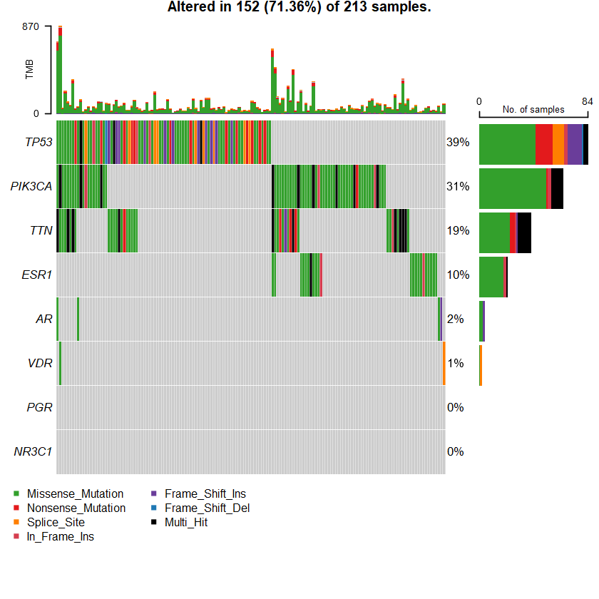
    


```R

```

## Multi-omics profiling of younger Asian breast cancers reveals distinctive molecular signatures
[REF: 29713003](https://doi.org/10.1038/s41467-018-04129-4)
Breast Cancer (SMC 2018)
Samples : 186


```R
df = read.maf(maf = "brca_smc_2018_data_mutations.txt")
samp = getSampleSummary(df)
head(samp, 10)
```

    -Reading
    -Validating
    -Silent variants: 22 
    -Summarizing
    --Possible FLAGS among top ten genes:
      TTN
      MUC16
      SYNE1
    -Processing clinical data
    --Missing clinical data
    -Finished in 0.780s elapsed (0.540s cpu) 
    


<table class="dataframe">
<caption>A data.table: 10 × 11</caption>
<thead>
	<tr><th scope=col>Tumor_Sample_Barcode</th><th scope=col>Frame_Shift_Del</th><th scope=col>Frame_Shift_Ins</th><th scope=col>In_Frame_Del</th><th scope=col>In_Frame_Ins</th><th scope=col>Missense_Mutation</th><th scope=col>Nonsense_Mutation</th><th scope=col>Nonstop_Mutation</th><th scope=col>Splice_Site</th><th scope=col>Translation_Start_Site</th><th scope=col>total</th></tr>
	<tr><th scope=col>&lt;fct&gt;</th><th scope=col>&lt;int&gt;</th><th scope=col>&lt;int&gt;</th><th scope=col>&lt;int&gt;</th><th scope=col>&lt;int&gt;</th><th scope=col>&lt;int&gt;</th><th scope=col>&lt;int&gt;</th><th scope=col>&lt;int&gt;</th><th scope=col>&lt;int&gt;</th><th scope=col>&lt;int&gt;</th><th scope=col>&lt;dbl&gt;</th></tr>
</thead>
<tbody>
	<tr><td>brca_smc_2018_BB01_111</td><td>1</td><td> 0</td><td>1</td><td>0</td><td>273</td><td>33</td><td>0</td><td>7</td><td>1</td><td>316</td></tr>
	<tr><td>brca_smc_2018_BR255   </td><td>7</td><td>11</td><td>6</td><td>9</td><td>161</td><td> 7</td><td>0</td><td>4</td><td>0</td><td>205</td></tr>
	<tr><td>brca_smc_2018_BB01_103</td><td>2</td><td> 1</td><td>0</td><td>1</td><td>152</td><td> 9</td><td>0</td><td>5</td><td>1</td><td>171</td></tr>
	<tr><td>brca_smc_2018_BB01_112</td><td>2</td><td> 1</td><td>1</td><td>1</td><td>128</td><td> 8</td><td>1</td><td>1</td><td>0</td><td>143</td></tr>
	<tr><td>brca_smc_2018_BB01_047</td><td>3</td><td> 1</td><td>0</td><td>0</td><td>123</td><td>11</td><td>0</td><td>2</td><td>1</td><td>141</td></tr>
	<tr><td>brca_smc_2018_BR097   </td><td>6</td><td> 1</td><td>0</td><td>2</td><td>115</td><td> 4</td><td>1</td><td>3</td><td>0</td><td>132</td></tr>
	<tr><td>brca_smc_2018_BB01_061</td><td>1</td><td> 0</td><td>1</td><td>0</td><td>117</td><td> 9</td><td>0</td><td>0</td><td>0</td><td>128</td></tr>
	<tr><td>brca_smc_2018_BB01_088</td><td>1</td><td> 2</td><td>0</td><td>0</td><td> 99</td><td>16</td><td>1</td><td>0</td><td>0</td><td>119</td></tr>
	<tr><td>brca_smc_2018_BB01_099</td><td>0</td><td> 0</td><td>0</td><td>0</td><td>108</td><td> 7</td><td>0</td><td>2</td><td>1</td><td>118</td></tr>
	<tr><td>brca_smc_2018_BR069   </td><td>2</td><td> 2</td><td>1</td><td>0</td><td> 99</td><td> 4</td><td>0</td><td>4</td><td>0</td><td>112</td></tr>
</tbody>
</table>


```R
genes = getGeneSummary(df)
head(genes,10)
```


<table class="dataframe">
<caption>A data.table: 10 × 13</caption>
<thead>
	<tr><th scope=col>Hugo_Symbol</th><th scope=col>Frame_Shift_Del</th><th scope=col>Frame_Shift_Ins</th><th scope=col>In_Frame_Del</th><th scope=col>In_Frame_Ins</th><th scope=col>Missense_Mutation</th><th scope=col>Nonsense_Mutation</th><th scope=col>Nonstop_Mutation</th><th scope=col>Splice_Site</th><th scope=col>Translation_Start_Site</th><th scope=col>total</th><th scope=col>MutatedSamples</th><th scope=col>AlteredSamples</th></tr>
	<tr><th scope=col>&lt;chr&gt;</th><th scope=col>&lt;int&gt;</th><th scope=col>&lt;int&gt;</th><th scope=col>&lt;int&gt;</th><th scope=col>&lt;int&gt;</th><th scope=col>&lt;int&gt;</th><th scope=col>&lt;int&gt;</th><th scope=col>&lt;int&gt;</th><th scope=col>&lt;int&gt;</th><th scope=col>&lt;int&gt;</th><th scope=col>&lt;dbl&gt;</th><th scope=col>&lt;int&gt;</th><th scope=col>&lt;int&gt;</th></tr>
</thead>
<tbody>
	<tr><td>TP53  </td><td>9</td><td> 4</td><td>2</td><td>0</td><td>54</td><td>16</td><td>0</td><td>4</td><td>0</td><td>89</td><td>89</td><td>89</td></tr>
	<tr><td>PIK3CA</td><td>0</td><td> 2</td><td>0</td><td>0</td><td>56</td><td> 0</td><td>0</td><td>0</td><td>0</td><td>58</td><td>53</td><td>53</td></tr>
	<tr><td>TTN   </td><td>1</td><td> 0</td><td>0</td><td>0</td><td>28</td><td> 0</td><td>0</td><td>0</td><td>0</td><td>29</td><td>23</td><td>23</td></tr>
	<tr><td>GATA3 </td><td>1</td><td>20</td><td>0</td><td>0</td><td> 1</td><td> 0</td><td>0</td><td>2</td><td>0</td><td>24</td><td>23</td><td>23</td></tr>
	<tr><td>MUC16 </td><td>0</td><td> 0</td><td>0</td><td>0</td><td>13</td><td> 0</td><td>0</td><td>0</td><td>0</td><td>13</td><td>12</td><td>12</td></tr>
	<tr><td>CSMD3 </td><td>0</td><td> 0</td><td>0</td><td>0</td><td> 9</td><td> 0</td><td>0</td><td>1</td><td>0</td><td>10</td><td> 9</td><td> 9</td></tr>
	<tr><td>MAP3K1</td><td>2</td><td> 2</td><td>1</td><td>0</td><td> 5</td><td> 0</td><td>0</td><td>0</td><td>0</td><td>10</td><td> 9</td><td> 9</td></tr>
	<tr><td>MAML3 </td><td>0</td><td> 0</td><td>0</td><td>8</td><td> 0</td><td> 0</td><td>0</td><td>0</td><td>0</td><td> 8</td><td> 8</td><td> 8</td></tr>
	<tr><td>ARID1A</td><td>2</td><td> 3</td><td>0</td><td>0</td><td> 1</td><td> 2</td><td>0</td><td>0</td><td>0</td><td> 8</td><td> 7</td><td> 7</td></tr>
	<tr><td>SYNE1 </td><td>0</td><td> 0</td><td>0</td><td>0</td><td> 7</td><td> 1</td><td>0</td><td>0</td><td>0</td><td> 8</td><td> 7</td><td> 7</td></tr>
</tbody>
</table>


```R
plotmafSummary(maf = df, rmOutlier = TRUE, addStat = 'median', dashboard = TRUE, titvRaw = FALSE)
```


    
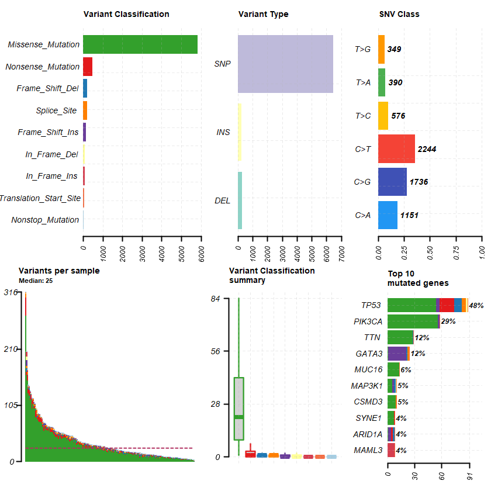
    


```R
genes %>% dplyr::filter(Hugo_Symbol %in% nrs)
```


<table class="dataframe">
<caption>A data.table: 1 × 13</caption>
<thead>
	<tr><th scope=col>Hugo_Symbol</th><th scope=col>Frame_Shift_Del</th><th scope=col>Frame_Shift_Ins</th><th scope=col>In_Frame_Del</th><th scope=col>In_Frame_Ins</th><th scope=col>Missense_Mutation</th><th scope=col>Nonsense_Mutation</th><th scope=col>Nonstop_Mutation</th><th scope=col>Splice_Site</th><th scope=col>Translation_Start_Site</th><th scope=col>total</th><th scope=col>MutatedSamples</th><th scope=col>AlteredSamples</th></tr>
	<tr><th scope=col>&lt;chr&gt;</th><th scope=col>&lt;int&gt;</th><th scope=col>&lt;int&gt;</th><th scope=col>&lt;int&gt;</th><th scope=col>&lt;int&gt;</th><th scope=col>&lt;int&gt;</th><th scope=col>&lt;int&gt;</th><th scope=col>&lt;int&gt;</th><th scope=col>&lt;int&gt;</th><th scope=col>&lt;int&gt;</th><th scope=col>&lt;dbl&gt;</th><th scope=col>&lt;int&gt;</th><th scope=col>&lt;int&gt;</th></tr>
</thead>
<tbody>
	<tr><td>AR</td><td>0</td><td>0</td><td>0</td><td>1</td><td>3</td><td>0</td><td>0</td><td>0</td><td>0</td><td>4</td><td>4</td><td>4</td></tr>
</tbody>
</table>


```R
sets = c("TTN", "TP53", "PIK3CA")
sts <- c(sets, nrs)
oncoplot(maf=df, genes = sts)
```


    
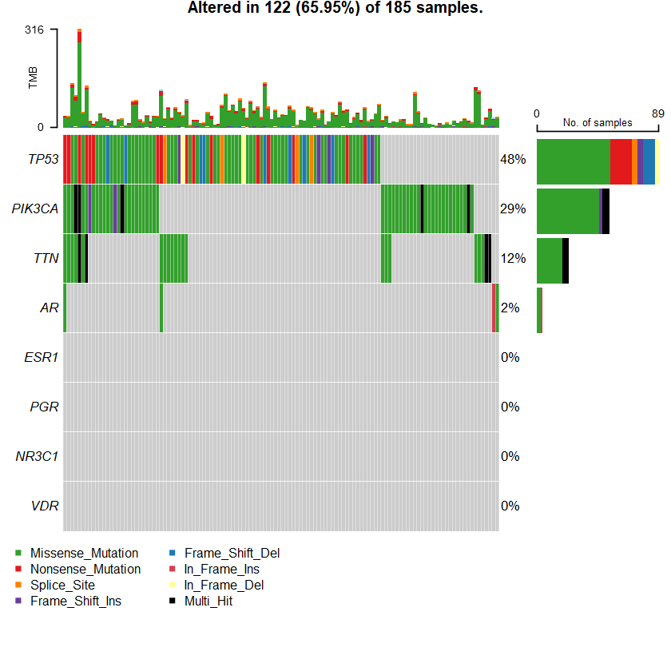
    


```R

```

## INK4 Tumor Suppressor Proteins Mediate Resistance to CDK4/6 Kinase Inhibitors
Metastatic Breast Cancer (MSK, Cancer Discovery 2022)
[REF: 34544752](https://doi.org/10.1158/2159-8290.cd-20-1726)

Samples: 1365


```R
df = read.maf(maf = "breast_ink4_msk_2021_data_mutations.txt")
```

    -Reading
    -Validating
    --Removed 24 duplicated variants
    -Silent variants: 21 
    -Summarizing
    --Mutiple centers found
    MSKCC;-Processing clinical data
    --Missing clinical data
    -Finished in 0.610s elapsed (0.400s cpu) 
    


```R
samp = getSampleSummary(df)
head(samp, 10)
```


<table class="dataframe">
<caption>A data.table: 10 × 11</caption>
<thead>
	<tr><th scope=col>Tumor_Sample_Barcode</th><th scope=col>Frame_Shift_Del</th><th scope=col>Frame_Shift_Ins</th><th scope=col>In_Frame_Del</th><th scope=col>In_Frame_Ins</th><th scope=col>Missense_Mutation</th><th scope=col>Nonsense_Mutation</th><th scope=col>Nonstop_Mutation</th><th scope=col>Splice_Site</th><th scope=col>Translation_Start_Site</th><th scope=col>total</th></tr>
	<tr><th scope=col>&lt;fct&gt;</th><th scope=col>&lt;int&gt;</th><th scope=col>&lt;int&gt;</th><th scope=col>&lt;int&gt;</th><th scope=col>&lt;int&gt;</th><th scope=col>&lt;int&gt;</th><th scope=col>&lt;int&gt;</th><th scope=col>&lt;int&gt;</th><th scope=col>&lt;int&gt;</th><th scope=col>&lt;int&gt;</th><th scope=col>&lt;dbl&gt;</th></tr>
</thead>
<tbody>
	<tr><td>P-0039857-T01-IM6</td><td>0</td><td>1</td><td>0</td><td>0</td><td>67</td><td>9</td><td>0</td><td>3</td><td>1</td><td>81</td></tr>
	<tr><td>P-0009602-T01-IM5</td><td>1</td><td>0</td><td>0</td><td>0</td><td>40</td><td>5</td><td>0</td><td>0</td><td>0</td><td>46</td></tr>
	<tr><td>P-0011567-T02-IM6</td><td>0</td><td>0</td><td>1</td><td>0</td><td>34</td><td>7</td><td>1</td><td>2</td><td>0</td><td>45</td></tr>
	<tr><td>P-0004987-T01-IM5</td><td>1</td><td>1</td><td>0</td><td>0</td><td>34</td><td>4</td><td>0</td><td>4</td><td>0</td><td>44</td></tr>
	<tr><td>P-0002713-T01-IM3</td><td>0</td><td>0</td><td>0</td><td>0</td><td>37</td><td>3</td><td>1</td><td>1</td><td>0</td><td>42</td></tr>
	<tr><td>P-0009364-T02-IM6</td><td>1</td><td>2</td><td>0</td><td>0</td><td>34</td><td>3</td><td>0</td><td>1</td><td>0</td><td>41</td></tr>
	<tr><td>P-0027986-T01-IM6</td><td>0</td><td>1</td><td>0</td><td>0</td><td>31</td><td>6</td><td>0</td><td>2</td><td>0</td><td>40</td></tr>
	<tr><td>P-0002124-T01-IM3</td><td>0</td><td>0</td><td>0</td><td>0</td><td>35</td><td>4</td><td>0</td><td>0</td><td>0</td><td>39</td></tr>
	<tr><td>P-0030930-T01-IM6</td><td>5</td><td>0</td><td>1</td><td>0</td><td>28</td><td>4</td><td>0</td><td>1</td><td>0</td><td>39</td></tr>
	<tr><td>P-0003233-T04-IM6</td><td>0</td><td>0</td><td>0</td><td>0</td><td>34</td><td>3</td><td>1</td><td>0</td><td>0</td><td>38</td></tr>
</tbody>
</table>


```R
genes = getGeneSummary(df)
head(genes,10)
```


<table class="dataframe">
<caption>A data.table: 10 × 13</caption>
<thead>
	<tr><th scope=col>Hugo_Symbol</th><th scope=col>Frame_Shift_Del</th><th scope=col>Frame_Shift_Ins</th><th scope=col>In_Frame_Del</th><th scope=col>In_Frame_Ins</th><th scope=col>Missense_Mutation</th><th scope=col>Nonsense_Mutation</th><th scope=col>Nonstop_Mutation</th><th scope=col>Splice_Site</th><th scope=col>Translation_Start_Site</th><th scope=col>total</th><th scope=col>MutatedSamples</th><th scope=col>AlteredSamples</th></tr>
	<tr><th scope=col>&lt;chr&gt;</th><th scope=col>&lt;int&gt;</th><th scope=col>&lt;int&gt;</th><th scope=col>&lt;int&gt;</th><th scope=col>&lt;int&gt;</th><th scope=col>&lt;int&gt;</th><th scope=col>&lt;int&gt;</th><th scope=col>&lt;int&gt;</th><th scope=col>&lt;int&gt;</th><th scope=col>&lt;int&gt;</th><th scope=col>&lt;dbl&gt;</th><th scope=col>&lt;int&gt;</th><th scope=col>&lt;int&gt;</th></tr>
</thead>
<tbody>
	<tr><td>PIK3CA</td><td> 2</td><td>  0</td><td>17</td><td>0</td><td>614</td><td> 0</td><td>0</td><td> 0</td><td>0</td><td>633</td><td>533</td><td>533</td></tr>
	<tr><td>TP53  </td><td>40</td><td> 17</td><td> 6</td><td>0</td><td>240</td><td>49</td><td>0</td><td>35</td><td>0</td><td>387</td><td>373</td><td>373</td></tr>
	<tr><td>ESR1  </td><td> 1</td><td>  1</td><td> 6</td><td>0</td><td>296</td><td> 0</td><td>0</td><td> 1</td><td>0</td><td>305</td><td>283</td><td>283</td></tr>
	<tr><td>CDH1  </td><td>69</td><td> 54</td><td> 4</td><td>0</td><td> 21</td><td>76</td><td>0</td><td>29</td><td>3</td><td>256</td><td>253</td><td>253</td></tr>
	<tr><td>GATA3 </td><td>52</td><td>142</td><td> 2</td><td>1</td><td> 35</td><td> 6</td><td>0</td><td>14</td><td>0</td><td>252</td><td>245</td><td>245</td></tr>
	<tr><td>KMT2C </td><td>37</td><td>  7</td><td> 2</td><td>0</td><td> 68</td><td>66</td><td>0</td><td> 3</td><td>0</td><td>183</td><td>152</td><td>152</td></tr>
	<tr><td>MAP3K1</td><td>54</td><td> 36</td><td> 5</td><td>0</td><td> 37</td><td>25</td><td>0</td><td> 5</td><td>0</td><td>162</td><td>123</td><td>123</td></tr>
	<tr><td>ARID1A</td><td>32</td><td> 19</td><td> 0</td><td>0</td><td> 20</td><td>43</td><td>0</td><td> 3</td><td>0</td><td>117</td><td>104</td><td>104</td></tr>
	<tr><td>AKT1  </td><td> 0</td><td>  0</td><td> 1</td><td>4</td><td>100</td><td> 1</td><td>0</td><td> 0</td><td>0</td><td>106</td><td>104</td><td>104</td></tr>
	<tr><td>FOXA1 </td><td>10</td><td>  3</td><td>19</td><td>2</td><td> 77</td><td> 1</td><td>0</td><td> 0</td><td>0</td><td>112</td><td>103</td><td>103</td></tr>
</tbody>
</table>


```R
plotmafSummary(maf = df, rmOutlier = TRUE, addStat = 'median', dashboard = TRUE, titvRaw = FALSE)
```


    
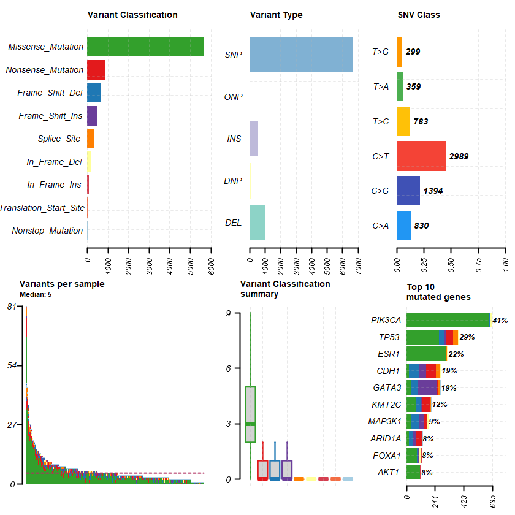
    


```R
genes %>% dplyr::filter(Hugo_Symbol %in% nrs)
```


<table class="dataframe">
<caption>A data.table: 3 × 13</caption>
<thead>
	<tr><th scope=col>Hugo_Symbol</th><th scope=col>Frame_Shift_Del</th><th scope=col>Frame_Shift_Ins</th><th scope=col>In_Frame_Del</th><th scope=col>In_Frame_Ins</th><th scope=col>Missense_Mutation</th><th scope=col>Nonsense_Mutation</th><th scope=col>Nonstop_Mutation</th><th scope=col>Splice_Site</th><th scope=col>Translation_Start_Site</th><th scope=col>total</th><th scope=col>MutatedSamples</th><th scope=col>AlteredSamples</th></tr>
	<tr><th scope=col>&lt;chr&gt;</th><th scope=col>&lt;int&gt;</th><th scope=col>&lt;int&gt;</th><th scope=col>&lt;int&gt;</th><th scope=col>&lt;int&gt;</th><th scope=col>&lt;int&gt;</th><th scope=col>&lt;int&gt;</th><th scope=col>&lt;int&gt;</th><th scope=col>&lt;int&gt;</th><th scope=col>&lt;int&gt;</th><th scope=col>&lt;dbl&gt;</th><th scope=col>&lt;int&gt;</th><th scope=col>&lt;int&gt;</th></tr>
</thead>
<tbody>
	<tr><td>ESR1</td><td>1</td><td>1</td><td>6</td><td>0</td><td>296</td><td>0</td><td>0</td><td>1</td><td>0</td><td>305</td><td>283</td><td>283</td></tr>
	<tr><td>AR  </td><td>0</td><td>0</td><td>2</td><td>0</td><td> 14</td><td>3</td><td>0</td><td>0</td><td>0</td><td> 19</td><td> 19</td><td> 19</td></tr>
	<tr><td>PGR </td><td>0</td><td>0</td><td>0</td><td>0</td><td>  7</td><td>0</td><td>0</td><td>0</td><td>0</td><td>  7</td><td>  7</td><td>  7</td></tr>
</tbody>
</table>


```R
sets = c("CDH1", "TP53", "PIK3CA")
sts <- c(sets, nrs)
oncoplot(maf=df, genes = sts)
```


    
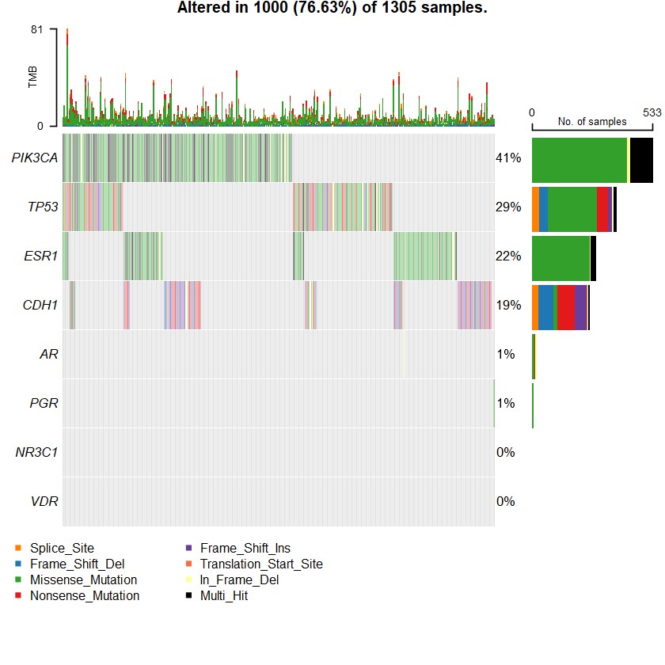
    


```R

```

## The Genomic Landscape of Endocrine-Resistant Advanced Breast Cancers

Breast Cancer (MSK, Cancer Cell 2018)
[REF: 30205045](https://doi.org/10.1016/j.ccell.2018.08.008)

Samples: 1918


```R
df = read.maf("breast_msk_2018_data_mutations.txt")
samp = getSampleSummary(df)
head(samp, 10)
```

    -Reading
    -Validating
    --Removed 50 duplicated variants
    -Silent variants: 46 
    -Summarizing
    --Mutiple centers found
    MSKCC;-Processing clinical data
    --Missing clinical data
    -Finished in 1.020s elapsed (0.660s cpu) 
    


<table class="dataframe">
<caption>A data.table: 10 × 11</caption>
<thead>
	<tr><th scope=col>Tumor_Sample_Barcode</th><th scope=col>Frame_Shift_Del</th><th scope=col>Frame_Shift_Ins</th><th scope=col>In_Frame_Del</th><th scope=col>In_Frame_Ins</th><th scope=col>Missense_Mutation</th><th scope=col>Nonsense_Mutation</th><th scope=col>Nonstop_Mutation</th><th scope=col>Splice_Site</th><th scope=col>Translation_Start_Site</th><th scope=col>total</th></tr>
	<tr><th scope=col>&lt;fct&gt;</th><th scope=col>&lt;int&gt;</th><th scope=col>&lt;int&gt;</th><th scope=col>&lt;int&gt;</th><th scope=col>&lt;int&gt;</th><th scope=col>&lt;int&gt;</th><th scope=col>&lt;int&gt;</th><th scope=col>&lt;int&gt;</th><th scope=col>&lt;int&gt;</th><th scope=col>&lt;int&gt;</th><th scope=col>&lt;dbl&gt;</th></tr>
</thead>
<tbody>
	<tr><td>P-0016773-T01-IM6</td><td>0</td><td>0</td><td>0</td><td>0</td><td>389</td><td>41</td><td>0</td><td>14</td><td>0</td><td>444</td></tr>
	<tr><td>P-0009602-T01-IM5</td><td>1</td><td>0</td><td>0</td><td>0</td><td> 40</td><td> 5</td><td>0</td><td> 0</td><td>0</td><td> 46</td></tr>
	<tr><td>P-0004987-T01-IM5</td><td>1</td><td>1</td><td>0</td><td>0</td><td> 34</td><td> 4</td><td>0</td><td> 4</td><td>0</td><td> 44</td></tr>
	<tr><td>P-0002713-T01-IM3</td><td>0</td><td>0</td><td>0</td><td>0</td><td> 37</td><td> 3</td><td>1</td><td> 1</td><td>0</td><td> 42</td></tr>
	<tr><td>P-0002124-T01-IM3</td><td>0</td><td>0</td><td>0</td><td>0</td><td> 35</td><td> 4</td><td>0</td><td> 0</td><td>0</td><td> 39</td></tr>
	<tr><td>P-0002713-T02-IM6</td><td>0</td><td>0</td><td>0</td><td>0</td><td> 29</td><td> 6</td><td>0</td><td> 0</td><td>1</td><td> 36</td></tr>
	<tr><td>P-0000138-T01-IM3</td><td>1</td><td>0</td><td>0</td><td>0</td><td> 24</td><td> 7</td><td>0</td><td> 1</td><td>0</td><td> 33</td></tr>
	<tr><td>P-0002858-T01-IM3</td><td>1</td><td>0</td><td>0</td><td>0</td><td> 29</td><td> 1</td><td>0</td><td> 1</td><td>0</td><td> 32</td></tr>
	<tr><td>P-0004555-T01-IM5</td><td>1</td><td>0</td><td>0</td><td>0</td><td> 23</td><td> 7</td><td>0</td><td> 0</td><td>0</td><td> 31</td></tr>
	<tr><td>P-0014136-T01-IM5</td><td>0</td><td>0</td><td>0</td><td>0</td><td> 29</td><td> 2</td><td>0</td><td> 0</td><td>0</td><td> 31</td></tr>
</tbody>
</table>


```R
genes = getGeneSummary(df)
head(genes,10)
```


<table class="dataframe">
<caption>A data.table: 10 × 13</caption>
<thead>
	<tr><th scope=col>Hugo_Symbol</th><th scope=col>Frame_Shift_Del</th><th scope=col>Frame_Shift_Ins</th><th scope=col>In_Frame_Del</th><th scope=col>In_Frame_Ins</th><th scope=col>Missense_Mutation</th><th scope=col>Nonsense_Mutation</th><th scope=col>Nonstop_Mutation</th><th scope=col>Splice_Site</th><th scope=col>Translation_Start_Site</th><th scope=col>total</th><th scope=col>MutatedSamples</th><th scope=col>AlteredSamples</th></tr>
	<tr><th scope=col>&lt;chr&gt;</th><th scope=col>&lt;int&gt;</th><th scope=col>&lt;int&gt;</th><th scope=col>&lt;int&gt;</th><th scope=col>&lt;int&gt;</th><th scope=col>&lt;int&gt;</th><th scope=col>&lt;int&gt;</th><th scope=col>&lt;int&gt;</th><th scope=col>&lt;int&gt;</th><th scope=col>&lt;int&gt;</th><th scope=col>&lt;dbl&gt;</th><th scope=col>&lt;int&gt;</th><th scope=col>&lt;int&gt;</th></tr>
</thead>
<tbody>
	<tr><td>PIK3CA</td><td> 3</td><td>  1</td><td>20</td><td>1</td><td>801</td><td>  0</td><td>0</td><td> 0</td><td>0</td><td>826</td><td>725</td><td>725</td></tr>
	<tr><td>TP53  </td><td>90</td><td> 34</td><td>19</td><td>2</td><td>385</td><td>106</td><td>0</td><td>59</td><td>0</td><td>695</td><td>680</td><td>680</td></tr>
	<tr><td>CDH1  </td><td>80</td><td> 66</td><td> 7</td><td>0</td><td> 25</td><td> 86</td><td>0</td><td>38</td><td>4</td><td>306</td><td>303</td><td>303</td></tr>
	<tr><td>GATA3 </td><td>51</td><td>168</td><td> 5</td><td>1</td><td> 47</td><td>  7</td><td>0</td><td>19</td><td>0</td><td>298</td><td>288</td><td>288</td></tr>
	<tr><td>ESR1  </td><td> 0</td><td>  1</td><td> 4</td><td>0</td><td>168</td><td>  1</td><td>0</td><td> 1</td><td>0</td><td>175</td><td>164</td><td>164</td></tr>
	<tr><td>MAP3K1</td><td>69</td><td> 50</td><td> 5</td><td>0</td><td> 48</td><td> 35</td><td>0</td><td>13</td><td>0</td><td>220</td><td>155</td><td>155</td></tr>
	<tr><td>PTEN  </td><td>34</td><td> 22</td><td> 7</td><td>0</td><td> 51</td><td> 27</td><td>0</td><td>14</td><td>0</td><td>155</td><td>137</td><td>137</td></tr>
	<tr><td>MLL3  </td><td>27</td><td>  9</td><td> 2</td><td>0</td><td> 55</td><td> 50</td><td>0</td><td> 5</td><td>0</td><td>148</td><td>130</td><td>130</td></tr>
	<tr><td>AKT1  </td><td> 1</td><td>  0</td><td> 0</td><td>3</td><td>104</td><td>  1</td><td>0</td><td> 0</td><td>0</td><td>109</td><td>107</td><td>107</td></tr>
	<tr><td>ARID1A</td><td>27</td><td> 20</td><td> 1</td><td>1</td><td> 24</td><td> 36</td><td>0</td><td> 4</td><td>0</td><td>113</td><td>106</td><td>106</td></tr>
</tbody>
</table>


```R
plotmafSummary(maf = df, rmOutlier = TRUE, addStat = 'median', dashboard = TRUE, titvRaw = FALSE)
```


    
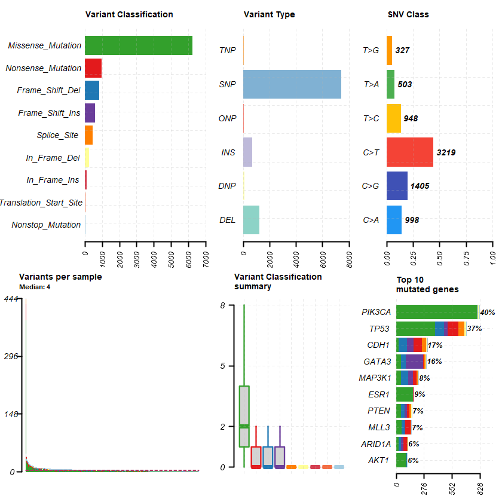
    


```R
genes %>% dplyr::filter(Hugo_Symbol %in% nrs)
```


<table class="dataframe">
<caption>A data.table: 3 × 13</caption>
<thead>
	<tr><th scope=col>Hugo_Symbol</th><th scope=col>Frame_Shift_Del</th><th scope=col>Frame_Shift_Ins</th><th scope=col>In_Frame_Del</th><th scope=col>In_Frame_Ins</th><th scope=col>Missense_Mutation</th><th scope=col>Nonsense_Mutation</th><th scope=col>Nonstop_Mutation</th><th scope=col>Splice_Site</th><th scope=col>Translation_Start_Site</th><th scope=col>total</th><th scope=col>MutatedSamples</th><th scope=col>AlteredSamples</th></tr>
	<tr><th scope=col>&lt;chr&gt;</th><th scope=col>&lt;int&gt;</th><th scope=col>&lt;int&gt;</th><th scope=col>&lt;int&gt;</th><th scope=col>&lt;int&gt;</th><th scope=col>&lt;int&gt;</th><th scope=col>&lt;int&gt;</th><th scope=col>&lt;int&gt;</th><th scope=col>&lt;int&gt;</th><th scope=col>&lt;int&gt;</th><th scope=col>&lt;dbl&gt;</th><th scope=col>&lt;int&gt;</th><th scope=col>&lt;int&gt;</th></tr>
</thead>
<tbody>
	<tr><td>ESR1</td><td>0</td><td>1</td><td>4</td><td>0</td><td>168</td><td>1</td><td>0</td><td>1</td><td>0</td><td>175</td><td>164</td><td>164</td></tr>
	<tr><td>AR  </td><td>0</td><td>0</td><td>2</td><td>1</td><td> 14</td><td>2</td><td>0</td><td>0</td><td>0</td><td> 19</td><td> 19</td><td> 19</td></tr>
	<tr><td>PGR </td><td>0</td><td>0</td><td>0</td><td>0</td><td>  3</td><td>1</td><td>0</td><td>1</td><td>0</td><td>  5</td><td>  4</td><td>  4</td></tr>
</tbody>
</table>


```R
sets = c("CDH1", "TP53", "PIK3CA")
sts <- c(sets, nrs)
oncoplot(maf=df, genes = sts)
```


    

    


## WARNING !!!!!!!!!!!
### The Analysis is Completed. Below are test data. Don't Consider


```R

```


```R

```


```R

```


```R

```


```R

```


```R

```


```R

```


```R

```


```R
dplyr::filter(as.data.frame(genes),
              Hugo_Symbol == "ESR1" | Hugo_Symbol == "PGR" | Hugo_Symbol == "NR3C1" | Hugo_Symbol == "AR" )
```


<table class="dataframe">
<caption>A data.frame: 3 × 13</caption>
<thead>
	<tr><th scope=col>Hugo_Symbol</th><th scope=col>Frame_Shift_Del</th><th scope=col>Frame_Shift_Ins</th><th scope=col>In_Frame_Del</th><th scope=col>In_Frame_Ins</th><th scope=col>Missense_Mutation</th><th scope=col>Nonsense_Mutation</th><th scope=col>Nonstop_Mutation</th><th scope=col>Splice_Site</th><th scope=col>Translation_Start_Site</th><th scope=col>total</th><th scope=col>MutatedSamples</th><th scope=col>AlteredSamples</th></tr>
	<tr><th scope=col>&lt;chr&gt;</th><th scope=col>&lt;int&gt;</th><th scope=col>&lt;int&gt;</th><th scope=col>&lt;int&gt;</th><th scope=col>&lt;int&gt;</th><th scope=col>&lt;int&gt;</th><th scope=col>&lt;int&gt;</th><th scope=col>&lt;int&gt;</th><th scope=col>&lt;int&gt;</th><th scope=col>&lt;int&gt;</th><th scope=col>&lt;dbl&gt;</th><th scope=col>&lt;int&gt;</th><th scope=col>&lt;int&gt;</th></tr>
</thead>
<tbody>
	<tr><td>ESR1</td><td>0</td><td>1</td><td>4</td><td>0</td><td>168</td><td>1</td><td>0</td><td>1</td><td>0</td><td>175</td><td>164</td><td>164</td></tr>
	<tr><td>AR  </td><td>0</td><td>0</td><td>2</td><td>1</td><td> 14</td><td>2</td><td>0</td><td>0</td><td>0</td><td> 19</td><td> 19</td><td> 19</td></tr>
	<tr><td>PGR </td><td>0</td><td>0</td><td>0</td><td>0</td><td>  3</td><td>1</td><td>0</td><td>1</td><td>0</td><td>  5</td><td>  4</td><td>  4</td></tr>
</tbody>
</table>


```R
rows_to_filter <- c("AR", "ESR1", "PGR", "NR3C1", "VDR")
```


```R
genes %>% dplyr::filter(Hugo_Symbol %in% rows_to_filter)
```


<table class="dataframe">
<caption>A data.table: 3 × 13</caption>
<thead>
	<tr><th scope=col>Hugo_Symbol</th><th scope=col>Frame_Shift_Del</th><th scope=col>Frame_Shift_Ins</th><th scope=col>In_Frame_Del</th><th scope=col>In_Frame_Ins</th><th scope=col>Missense_Mutation</th><th scope=col>Nonsense_Mutation</th><th scope=col>Nonstop_Mutation</th><th scope=col>Splice_Site</th><th scope=col>Translation_Start_Site</th><th scope=col>total</th><th scope=col>MutatedSamples</th><th scope=col>AlteredSamples</th></tr>
	<tr><th scope=col>&lt;chr&gt;</th><th scope=col>&lt;int&gt;</th><th scope=col>&lt;int&gt;</th><th scope=col>&lt;int&gt;</th><th scope=col>&lt;int&gt;</th><th scope=col>&lt;int&gt;</th><th scope=col>&lt;int&gt;</th><th scope=col>&lt;int&gt;</th><th scope=col>&lt;int&gt;</th><th scope=col>&lt;int&gt;</th><th scope=col>&lt;dbl&gt;</th><th scope=col>&lt;int&gt;</th><th scope=col>&lt;int&gt;</th></tr>
</thead>
<tbody>
	<tr><td>ESR1</td><td>0</td><td>1</td><td>4</td><td>0</td><td>168</td><td>1</td><td>0</td><td>1</td><td>0</td><td>175</td><td>164</td><td>164</td></tr>
	<tr><td>AR  </td><td>0</td><td>0</td><td>2</td><td>1</td><td> 14</td><td>2</td><td>0</td><td>0</td><td>0</td><td> 19</td><td> 19</td><td> 19</td></tr>
	<tr><td>PGR </td><td>0</td><td>0</td><td>0</td><td>0</td><td>  3</td><td>1</td><td>0</td><td>1</td><td>0</td><td>  5</td><td>  4</td><td>  4</td></tr>
</tbody>
</table>


```R

```


```R
genes = c("TP53", "PIK3CA", "GATA3", "NR3C1", "PGR", "AR", "ESR1")
```


```R
oncoplot(maf=df, genes = genes)
```


    
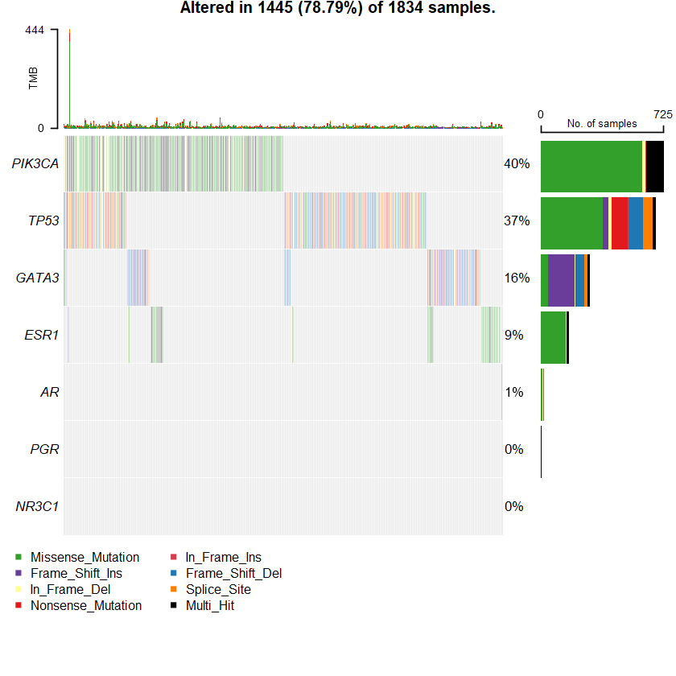
    


```R

```


```R

```


```R
# First, let's create your dataframe
data <- data.frame(
    ID = c("a1", "a2", "a3", "a4", "a5", "a6", "a7", "a8", "a9", "a10", "a11", "a12"),
    SA1 = c(9, 2, 10, 4, 0, 10, 1, 8, 5, 1, 1, 5),
    SA2 = c(10, 8, 1, 7, 0, 4, 0, 1, 9, 9, 2, 5),
    SA3 = c(9, 2, 10, 2, 3, 3, 5, 1, 5, 9, 5, 0),
    SA4 = c(5, 9, 0, 9, 2, 1, 9, 3, 9, 1, 1, 6),
    SA5 = c(8, 10, 9, 2, 8, 9, 8, 7, 10, 6, 10, 7),
    SA6 = c(0, 10, 2, 4, 0, 2, 7, 7, 4, 6, 4, 7),
    SA7 = c(2, 5, 2, 4, 1, 4, 6, 5, 7, 3, 6, 6))
data
# # Define the list of rows you want to filter
# rows_to_filter <- c("a2", "a5", "a6", "a9", "a11")

# # Filter the dataframe based on the specified rows
# filtered_data <- data %>% filter(ID %in% rows_to_filter)

# # Print the filtered dataframe
# filtered_data

```


<table class="dataframe">
<caption>A data.frame: 12 × 8</caption>
<thead>
	<tr><th scope=col>ID</th><th scope=col>SA1</th><th scope=col>SA2</th><th scope=col>SA3</th><th scope=col>SA4</th><th scope=col>SA5</th><th scope=col>SA6</th><th scope=col>SA7</th></tr>
	<tr><th scope=col>&lt;chr&gt;</th><th scope=col>&lt;dbl&gt;</th><th scope=col>&lt;dbl&gt;</th><th scope=col>&lt;dbl&gt;</th><th scope=col>&lt;dbl&gt;</th><th scope=col>&lt;dbl&gt;</th><th scope=col>&lt;dbl&gt;</th><th scope=col>&lt;dbl&gt;</th></tr>
</thead>
<tbody>
	<tr><td>a1 </td><td> 9</td><td>10</td><td> 9</td><td>5</td><td> 8</td><td> 0</td><td>2</td></tr>
	<tr><td>a2 </td><td> 2</td><td> 8</td><td> 2</td><td>9</td><td>10</td><td>10</td><td>5</td></tr>
	<tr><td>a3 </td><td>10</td><td> 1</td><td>10</td><td>0</td><td> 9</td><td> 2</td><td>2</td></tr>
	<tr><td>a4 </td><td> 4</td><td> 7</td><td> 2</td><td>9</td><td> 2</td><td> 4</td><td>4</td></tr>
	<tr><td>a5 </td><td> 0</td><td> 0</td><td> 3</td><td>2</td><td> 8</td><td> 0</td><td>1</td></tr>
	<tr><td>a6 </td><td>10</td><td> 4</td><td> 3</td><td>1</td><td> 9</td><td> 2</td><td>4</td></tr>
	<tr><td>a7 </td><td> 1</td><td> 0</td><td> 5</td><td>9</td><td> 8</td><td> 7</td><td>6</td></tr>
	<tr><td>a8 </td><td> 8</td><td> 1</td><td> 1</td><td>3</td><td> 7</td><td> 7</td><td>5</td></tr>
	<tr><td>a9 </td><td> 5</td><td> 9</td><td> 5</td><td>9</td><td>10</td><td> 4</td><td>7</td></tr>
	<tr><td>a10</td><td> 1</td><td> 9</td><td> 9</td><td>1</td><td> 6</td><td> 6</td><td>3</td></tr>
	<tr><td>a11</td><td> 1</td><td> 2</td><td> 5</td><td>1</td><td>10</td><td> 4</td><td>6</td></tr>
	<tr><td>a12</td><td> 5</td><td> 5</td><td> 0</td><td>6</td><td> 7</td><td> 7</td><td>6</td></tr>
</tbody>
</table>


```R
# Define the list of columns you want to filter
columns_to_filter <- c("SA1", "SA3", "SA4", "SA7", "AGFH")
# Find the intersection of specified columns and existing columns in the dataframe
valid_columns <- intersect(columns_to_filter, colnames(data))
valid_columns
```


<style>
.list-inline {list-style: none; margin:0; padding: 0}
.list-inline>li {display: inline-block}
.list-inline>li:not(:last-child)::after {content: "\00b7"; padding: 0 .5ex}
</style>
<ol class=list-inline><li>'SA1'</li><li>'SA3'</li><li>'SA4'</li><li>'SA7'</li></ol>


```R
# Filter the dataframe based on the valid columns
filtered_data <- data[, c("ID", valid_columns)]
filtered_data
```


<table class="dataframe">
<caption>A data.frame: 12 × 5</caption>
<thead>
	<tr><th scope=col>ID</th><th scope=col>SA1</th><th scope=col>SA3</th><th scope=col>SA4</th><th scope=col>SA7</th></tr>
	<tr><th scope=col>&lt;chr&gt;</th><th scope=col>&lt;dbl&gt;</th><th scope=col>&lt;dbl&gt;</th><th scope=col>&lt;dbl&gt;</th><th scope=col>&lt;dbl&gt;</th></tr>
</thead>
<tbody>
	<tr><td>a1 </td><td> 9</td><td> 9</td><td>5</td><td>2</td></tr>
	<tr><td>a2 </td><td> 2</td><td> 2</td><td>9</td><td>5</td></tr>
	<tr><td>a3 </td><td>10</td><td>10</td><td>0</td><td>2</td></tr>
	<tr><td>a4 </td><td> 4</td><td> 2</td><td>9</td><td>4</td></tr>
	<tr><td>a5 </td><td> 0</td><td> 3</td><td>2</td><td>1</td></tr>
	<tr><td>a6 </td><td>10</td><td> 3</td><td>1</td><td>4</td></tr>
	<tr><td>a7 </td><td> 1</td><td> 5</td><td>9</td><td>6</td></tr>
	<tr><td>a8 </td><td> 8</td><td> 1</td><td>3</td><td>5</td></tr>
	<tr><td>a9 </td><td> 5</td><td> 5</td><td>9</td><td>7</td></tr>
	<tr><td>a10</td><td> 1</td><td> 9</td><td>1</td><td>3</td></tr>
	<tr><td>a11</td><td> 1</td><td> 5</td><td>1</td><td>6</td></tr>
	<tr><td>a12</td><td> 5</td><td> 0</td><td>6</td><td>6</td></tr>
</tbody>
</table>


```R
# Define the list of columns you want to filter
columns_to_filter <- c("SA1", "SA3", "SA4", "SA7", "AGFH")

# Find the intersection of specified columns and existing columns in the dataframe
valid_columns <- intersect(columns_to_filter, colnames(data))

# Filter the dataframe based on the valid columns
filtered_data <- data[, c("ID", valid_columns)]

# Print the filtered dataframe
print(filtered_data)

```


```R

```


```R

```
